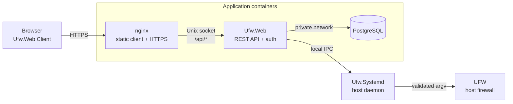

# UFWeb

UFWeb is a web interface for managing UFW on a host without making the web application the firewall authority. UFW remains the source of truth for live rules and policy; UFWeb reads that state through a small privileged host daemon and stores only application-owned data such as users, rule notes/tags, known-host aliases, and network-interface annotations in PostgreSQL.

The project is designed to coexist with normal UFW administration. Rules created or changed outside UFWeb remain visible on the next refresh, unsupported UFW syntax remains observable rather than being hidden, and mutations are resolved against fresh firewall state instead of treating UFW's changing display numbers as durable rule IDs.

## What UFWeb provides

The browser application covers the normal firewall-management workflow while keeping the distinction between firewall state and application metadata visible:

- inspect whether UFW is active, its IPv4/IPv6 rule sets, IPv6 capability, and incoming/outgoing/routed default policies;
- create, insert, delete, and reorder supported rules through signed mutation requests;
- search and filter the loaded rule set using structural rule fields, comments, canonical UFW syntax, tags, and known-host context, with match evidence shown alongside results;
- attach notes and reusable colored tags to semantic rules without turning that metadata into firewall authority;
- maintain known-host aliases and reconciled network-interface metadata to make rule authoring easier while signing only literal firewall semantics;
- reconcile metadata whose rule disappeared because UFW was changed out-of-band;
- inspect the management API, daemon, and firewall boundaries independently from the status page.

`Ufw.Mock` implements the UFW command surface used by the daemon for development and tests, so most of the real application path can run on machines without UFW or firewall privileges.

## Deployment at a glance

A production deployment separates browser delivery, the web/API process, application persistence, and privileged firewall execution:



nginx is the public endpoint. It serves the independently built WebAssembly client and proxies API requests to a private `Ufw.Web` container. `Ufw.Systemd` runs directly on the host under systemd and is the only UFWeb process allowed to invoke UFW. PostgreSQL is private to `Ufw.Web` and does not contain a shadow copy of the firewall.

Rootful and rootless Docker use this same topology with different host ownership/group mappings. See [Production deployment](docs/deployment/deployment.md) for the supported runbooks and operational model.

## Firewall mutations and trust

A logged-in web session is necessary to use the management API, but it is not sufficient authority to change the firewall. Privileged mutations use a second authorization path:

1. the browser loads the authoritative rule snapshot and the daemon's signing context;
2. the administrator supplies an authorized P-256 private key to the browser for the operation;
3. the browser signs the exact mutation semantics, including snapshot/ordering context where the operation depends on reviewed state;
4. `Ufw.Web` forwards the signed request but cannot create a valid mutation signature itself;
5. `Ufw.Systemd` independently validates the signature, deployment scope, freshness, replay nonce, operation semantics, and fresh UFW state before rendering argv and executing UFW without a shell;
6. after execution, the daemon re-reads authoritative state and reports a mutation as confirmed only when the expected result can be established safely.

The frontend is therefore part of the signing trust boundary. Production nginx serves the client from a separate read-only image so compromise of the ASP process alone is not enough to replace the browser signing application.

The browser/front-end artifact and privileged daemon are still trusted components of this design. Compromise of an administrator browser, the frontend artifact, or the daemon remains security-significant. See [Security architecture](docs/architecture/security.md) for the full trust model and [Firewall state and rule model](docs/architecture/firewall-model.md) for mutation identity and reconciliation semantics.

## Getting started

The solution targets .NET 10. For a normal source build:

```bash
dotnet restore src/Ufw.slnx
dotnet build src/Ufw.slnx --no-restore
dotnet test src/Ufw.slnx --no-restore --no-build
```

Local development runs the browser client, `Ufw.Web`, PostgreSQL, and the daemon as separate processes. The setup script generates development certificates/keys and configuration, while `Ufw.Mock` can stand in for UFW on Windows or an unprivileged development host.

See [Local development](docs/development/local-development.md) for the complete setup. For production, start with [Production deployment](docs/deployment/deployment.md) rather than the development Compose file.

## Documentation

The documentation is split by audience rather than by implementation file:

| Document | Purpose |
| --- | --- |
| [Architecture overview](docs/architecture/architecture-overview.md) | System model, component boundaries, state ownership, and end-to-end request flows |
| [Browser application](docs/architecture/browser-application.md) | Client layering, authoritative inventory state, projections, filtering, metadata, and UI interaction boundaries |
| [Firewall state and rule model](docs/architecture/firewall-model.md) | Rule semantics, identity, family ordering, mutation lifecycles, and reconciliation |
| [Security architecture](docs/architecture/security.md) | Trust boundaries, web sessions, signed intents, replay protection, and privileged execution |
| [Compile-time routing and serialization](docs/architecture/source-generation.md) | NativeAOT-oriented controller and JSON source-generation boundaries |
| [IPC protocols](docs/protocols/README.md) | Transport, application envelopes, routing, and signed-intent wire contracts |
| [Production deployment](docs/deployment/deployment.md) | Production topology, deployment model selection, configuration, and operations entry points |
| [Local development](docs/development/local-development.md) | Development prerequisites, generated state, and run sequence |
| [Client UI development](docs/development/client-ui.md) | Browser source organization and colocated/global/isolated SCSS conventions |
| [UFW mock](docs/development/ufw-mock.md) | UFW-compatible development/test command surface |
| [IPC test adapter](docs/testing/ipc-test-adapter.md) | Production-equivalent in-process IPC testing |

`docs/internal` is non-normative maintainer space for unresolved work only. Completed behavior belongs in the permanent architecture, protocol, deployment, development, or testing documentation.

## Source layout

The main projects follow process and contract boundaries:

| Project | Role |
| --- | --- |
| `Ufw.Web.Client` | Blazor WebAssembly application |
| `Ufw.Web.Model` | pure, versioned REST DTOs shared by ASP and Blazor |
| `Ufw.Web` | authenticated REST API and PostgreSQL-backed application state |
| `Ufw.Systemd` | privileged daemon and UFW execution boundary |
| `Ufw.Shared` | firewall semantics, signed-intent primitives, and IPC contracts shared across processes |
| `Ufw.Ipc.Client` | typed client for the daemon IPC protocol |
| `Ufw.Roslyn` / `Ufw.Roslyn.SourceGen` | routing/serialization contracts and compile-time generated bindings |
| `Ufw.Mock` | development/test UFW-compatible executable |

For contributor conventions, see [`code-style.md`](code-style.md) and the architecture documents relevant to the subsystem being changed.

## License

UFWeb is licensed under the [MIT License](LICENSE).
