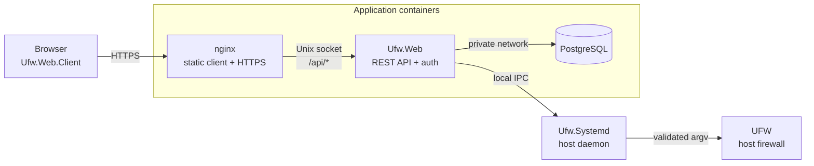

# UFWeb

UFWeb is a web interface for managing UFW on a host without making the web application the firewall authority. UFW remains the source of truth for live rules and policy; UFWeb reads that state through a small privileged host daemon and stores only application-owned data such as users, rule notes and tags, known-host aliases, and network-interface annotations in PostgreSQL.

The design deliberately coexists with normal UFW administration. Rules created or changed outside UFWeb appear on the next refresh, unsupported UFW syntax remains visible rather than being hidden, and mutations are resolved against fresh firewall state instead of treating UFW's changing display numbers as durable identifiers.

## What UFWeb provides

The browser covers the normal rule-management workflow for both IPv4 and IPv6. It shows UFW activity, default policies, and the ordered rule sets; supports append, ordered insertion, deletion, and reordering for rules whose semantics UFWeb understands completely; and provides client-side filtering and search over structural rule fields, comments, canonical UFW syntax, tags, and known-host context. Search results retain match evidence so the interface can explain why a rule matched rather than presenting an opaque filtered list.

UFWeb also adds presentation and authoring context without making that metadata part of the firewall contract. Notes and reusable colored tags attach to semantic rule identity. Known-host aliases may contain a literal address directly or use DNS as a configuration convenience, but in both cases rule authoring sees only the resolved literal address. Reconciled network-interface metadata can carry comments and visibility preferences while the daemon still validates the real host interface immediately before a mutation. When UFW changes out of band, the interface continues to show the authoritative firewall state and provides an explicit reconciliation workflow for metadata that no longer matches a live rule.

Operational status is split along the same boundaries as the architecture. The status page can distinguish the browser-facing management API, the local daemon path, and authoritative UFW observation instead of treating a successfully loaded page as proof that the complete firewall-management path is healthy.

`Ufw.Mock` implements the UFW command surface used by the daemon for development and tests, which allows most of the real application path to run on machines without UFW or firewall privileges.

## Deployment at a glance

A production deployment separates browser delivery, the web/API process, application persistence, and privileged firewall execution:



nginx is the public endpoint. It serves the independently built WebAssembly client and proxies API requests to a private `Ufw.Web` container. PostgreSQL is reachable only from the web application and contains application-owned state rather than a shadow copy of the firewall. `Ufw.Systemd` runs directly on the host under systemd and is the only UFWeb process allowed to execute UFW.

Rootful and rootless Docker use the same application topology but differ in how host ownership and supplemental groups are mapped into the containers. The [production deployment guide](docs/deployment/deployment.md) explains the supported modes and links to their concrete runbooks.

## Firewall mutations and trust

A logged-in web session is necessary to use the management API, but it is deliberately not sufficient authority to change the firewall. A privileged mutation follows a second authorization path:

1. the browser loads the authoritative rule snapshot and the daemon's signing context;
2. the administrator supplies an authorized P-256 private key to the browser for the operation;
3. the browser signs the exact mutation semantics, including snapshot and ordering context where the operation depends on reviewed state;
4. `Ufw.Web` forwards the signed request but cannot create a valid mutation signature itself;
5. `Ufw.Systemd` independently validates the signature, deployment scope, freshness, replay nonce, operation semantics, and fresh UFW state before rendering argv and executing UFW without a shell;
6. after execution, the daemon re-reads authoritative state and reports the mutation as confirmed only when the expected result can be established safely.

The frontend is therefore part of the signing trusted computing base. Production nginx serves the client from a separate read-only image so compromise of the ASP process alone is not enough to replace the browser signing application. The browser environment, frontend artifact, daemon, and administrator-held mutation key remain security-significant components; UFWeb does not try to turn a compromised administrator browser or privileged daemon into a safe execution environment.

The [security architecture](docs/architecture/security.md) develops this trust model in detail. The [firewall state and rule model](docs/architecture/firewall-model.md) explains semantic rule identity, state-conditioned insertion/reorder operations, and reconciliation after uncertain or out-of-band changes.

## Getting started

The solution targets .NET 10. A normal source build can be validated with:

```bash
dotnet restore src/Ufw.slnx
dotnet build src/Ufw.slnx --no-restore
dotnet test src/Ufw.slnx --no-restore --no-build
```

Local development runs the browser client, `Ufw.Web`, PostgreSQL, and the daemon as separate processes. The setup script generates development certificates, signing keys, and configuration, while `Ufw.Mock` can stand in for UFW on Windows or an unprivileged development host. The complete workflow is documented in [Local development](docs/development/local-development.md). Production deployments should start with [Production deployment](docs/deployment/deployment.md) rather than the repository-root development Compose file.

## Documentation

For a top-to-bottom understanding of the system, start with the [architecture overview](docs/architecture/architecture-overview.md). From there, the [browser application architecture](docs/architecture/browser-application.md) describes client state and layering, the [firewall state and rule model](docs/architecture/firewall-model.md) covers rule identity and mutation lifecycles, and the [security architecture](docs/architecture/security.md) explains the trust boundaries and signed authorization model. The [IPC protocol index](docs/protocols/README.md) is the entry point for wire-level contracts.

Operators should use the [production deployment guide](docs/deployment/deployment.md), its linked rootful/rootless runbooks, the [configuration reference](docs/deployment/configuration.md), and the [operations guide](docs/deployment/operations.md). Contributors can start with [Local development](docs/development/local-development.md), [Client UI development](docs/development/client-ui.md), and [`code-style.md`](code-style.md). The `docs/internal` directory is intentionally non-normative maintainer space for unresolved design work; implemented behavior belongs in the permanent architecture, protocol, deployment, development, or testing documentation.

The solution is divided along process and contract boundaries rather than UI pages. `Ufw.Web.Client` is the browser application, `Ufw.Web` is the authenticated REST/API and persistence process, and `Ufw.Systemd` is the privileged host daemon. `Ufw.Web.Model` carries versioned REST DTOs shared between browser and ASP, while `Ufw.Shared` carries lower-level firewall, security, and IPC contracts. `Ufw.Ipc.Client` provides ASP's typed daemon client, the Roslyn projects generate compile-time routing and serialization glue, and `Ufw.Mock` supplies the development/test UFW-compatible executable. The architecture documentation describes these dependencies in context instead of treating the project list as an API surface.

## License

UFWeb is licensed under the [MIT License](LICENSE).
