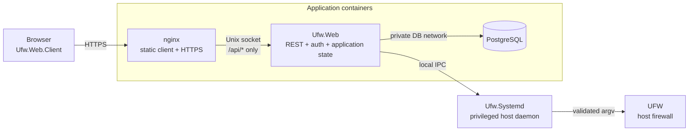
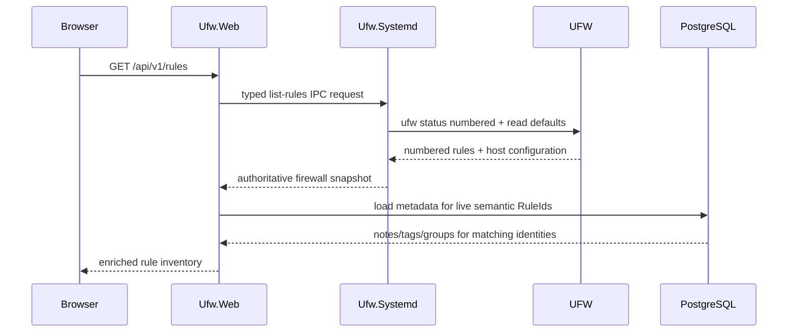
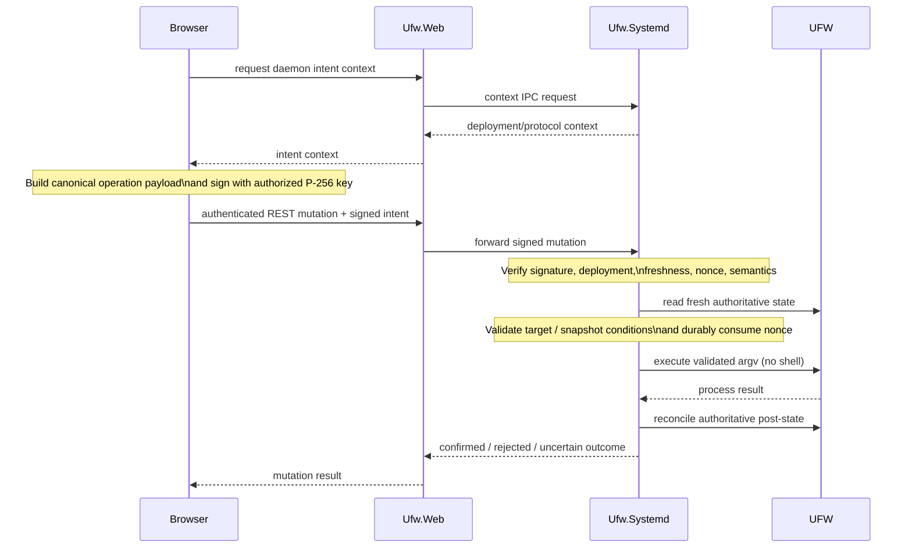

# UFWeb Architecture

UFWeb manages UFW through a web application while deliberately leaving firewall authority on the host. Three constraints drive the architecture. UFW remains the source of truth even when administrators use the normal CLI or other host tooling; network-facing application code never executes firewall commands directly; and an authenticated web session is not, by itself, authorization to perform a privileged firewall mutation. The browser and ASP application provide the management workflow around those constraints, while a small host daemon observes and mutates UFW under a separate authorization boundary.

Those choices explain most of the system that follows. They determine why firewall state is read rather than mirrored into PostgreSQL, why the daemon exists outside the container stack, why browser-signed mutation intents are distinct from REST authentication, and why the client treats its filtered or reordered views as projections over an authoritative snapshot rather than as mutable firewall state. Detailed rule semantics live in [Firewall state and rule model](firewall-model.md), the trust model in [Security architecture](security.md), and wire-level contracts under [IPC protocols](../protocols/README.md).

## System topology

A production deployment places the browser-facing application in containers but keeps privileged firewall execution on the host:

nginx is the only public application endpoint. It terminates browser TLS, serves the independently built WebAssembly application, and proxies `/api/*` to `Ufw.Web` over a private Unix socket. `Ufw.Web` therefore needs no public TCP listener in the production Compose topology, and PostgreSQL is reachable only from the web application on an internal container network.

`Ufw.Systemd` runs directly on the firewall host under systemd and is the only UFWeb component that executes UFW. The application containers do not need netfilter privileges, access to UFW configuration files, the host Docker socket, or write access to daemon authorization state. This keeps the privileged surface small and makes it possible to reason about firewall authority independently from the much larger HTTP and UI stacks.

The separate frontend image is also security-relevant. Browser code constructs and signs privileged requests, so the delivered client artifact is part of the signing trusted computing base. Serving that artifact from a read-only nginx image, rather than from the ASP process, means compromise of `Ufw.Web` alone does not give the attacker a direct way to replace the browser signing application.

## From presentation to firewall authority

The runtime components form a chain in which each layer owns a different concern. The browser owns presentation and browser-local workflow state. `Ufw.Web` owns web authentication, REST resources, and application persistence. `Ufw.Systemd` owns privileged host observation and mutation. UFW and the operating system remain authoritative for the underlying firewall and interface state.

### Browser application

`Ufw.Web.Client` authenticates to the REST API, loads authoritative firewall snapshots, combines those snapshots with application-owned metadata for presentation, validates rule input for usability, and creates signed mutation intents. It talks only to HTTP resources exposed by `Ufw.Web`; it does not know how the daemon transport is framed or how UFW subprocesses are constructed. Browser and ASP compile against the same versioned REST DTOs from `Ufw.Web.Model`, which keeps the transport contract shared without coupling client feature logic to server implementation code.

The browser keeps short-lived access JWTs in memory, while the refresh token is held in an `HttpOnly` cookie. Administrator mutation private keys are supplied to the signing workflow for individual operations and are not persisted by UFWeb. Browser-side validation provides immediate feedback and prevents obviously invalid requests from being composed, but it is not an authorization boundary. The daemon reconstructs and validates the signed semantics independently before any privileged execution takes place.

The client's internal state, projection, filtering, and UI boundaries are described in [Browser application architecture](browser-application.md).

### Web application and PostgreSQL

`Ufw.Web` is the authenticated HTTP boundary and the owner of application persistence. It handles ASP.NET Core Identity users, rotating refresh-token families, known-host aliases, reconciled network-interface presentation metadata, and rule notes, tags, and groups. Those records support authentication, authoring, organization, and presentation, but they do not form a second firewall database.

That distinction is important when the host changes outside UFWeb. A rule metadata record says that UFWeb has metadata for a semantic rule identity; it does not prove that such a rule is currently present. Likewise, an interface comment belongs to an interface name previously observed on the host, not to a persistent interface object controlled by PostgreSQL. Live firewall and interface state is always re-established through the daemon.

Database entities use ordinary numeric surrogate keys internally. API-visible application entities use UUIDv7 identifiers so persistence details do not leak through the REST boundary. Related Identity and application updates share database transactions when partial commit would violate a workflow, while security-relevant state such as failed-login counters or refresh-family revocation can still be persisted when an authentication attempt itself fails.

### Privileged daemon

`Ufw.Systemd` is the host firewall security boundary. It accepts typed local IPC requests, observes and parses UFW state, observes current host interfaces, verifies signed mutation intents against operator-managed public keys, maintains replay and deployment state, serializes UFW access, and renders validated argv for direct child-process execution. It also owns the process after launch until normal completion or cancellation cleanup has finished.

Read-only endpoints expose daemon liveness, authoritative rule/configuration snapshots, host-interface names, and the signing context required by the browser. Mutation endpoints add a second authorization path: the signed intent must be valid, fresh, non-replayed, scoped to the current daemon deployment, and consistent with fresh host state before the request can enter the UFW execution gate.

The daemon never treats a successful process exit as sufficient proof that the requested state change occurred. After a mutation it reads UFW again and reconciles the observed state with the requested postcondition. Compound reorder operations additionally use a durable recovery record because a delete/reinsert move can be interrupted after a rule has been removed but before it has been restored at its new position.

### Shared contracts

Cross-process contracts are shared without merging process responsibilities. `Ufw.Shared` contains firewall semantics, normalization and rendering, signed-intent primitives, IPC contracts, and lower-level protocol serialization metadata used across the browser/web/daemon boundary. `Ufw.Web.Model` contains pure, versioned REST request and response DTOs shared by `Ufw.Web` and `Ufw.Web.Client`; it may reuse lower-level `Ufw.Shared` contract types, but it does not depend on ASP persistence/services or client feature/UI code.

`Ufw.Ipc.Client` supplies the typed daemon client used by `Ufw.Web`. `Ufw.Roslyn` and `Ufw.Roslyn.SourceGen` provide the runtime contracts and compile-time routing/serialization bindings that keep daemon dispatch and JSON metadata explicit and NativeAOT-compatible. Their role is described in [Compile-time routing and serialization](source-generation.md).

## State ownership

UFWeb's central state-model distinction is between authoritative host state, application-owned state, and browser-derived presentation. The following table is intentionally small because the categories, rather than every individual field, are the architectural contract.

| State class | Primary owner | Architectural meaning |
| --- | --- | --- |
| Firewall and host state | UFW / host OS, observed through `Ufw.Systemd` | Authoritative rules, active state, IPv6 capability, default policies, and current interface names. PostgreSQL cannot reconstruct these values. |
| Application state | `Ufw.Web` / PostgreSQL | Users, refresh-token families, known-host aliases and DNS-resolution metadata, interface presentation metadata, and rule notes/tags/groups. These records enrich workflows but cannot make firewall state exist. |
| Daemon security and recovery state | `Ufw.Systemd` / operator-managed files | Authorized public keys, deployment identity, replay records, and reorder recovery state. This state is not writable through the REST API. |
| Browser workflow state | `Ufw.Web.Client` | Access token, current loaded snapshot, filters, match evidence, ordering previews, and transient UI state. Derived views never replace the authoritative snapshot. |

The lifecycle of each piece of metadata follows its owner. Interface metadata can be reconciled against current host interface names. Known-host aliases are also entirely ASP-owned: a DNS-backed alias may be reconciled against DNS inside the application, but that operation only refreshes the literal address stored in the alias catalog and never reaches the daemon or rewrites firewall rules. Rule metadata is joined only to live semantic identities; if a rule disappears out of band, its metadata can remain stored but unmatched until an explicit operator-reviewed cleanup. Rule groups are independent ASP entities that may be empty; a nullable membership on semantic rule metadata places one rule in at most one group. Administrator mutation private keys are different again: they belong to the administrator/browser workflow and are never application persistence at all.

## Reading firewall state

Most management workflows begin with one authoritative rule-list operation:

The daemon executes the required UFW reads under its serialized execution gate and a deterministic locale. Rows it can understand completely become normalized structural rules with semantic identity. A row that cannot be parsed and validated completely is still returned as observable raw firewall state, but it is not promoted into a target for semantic mutation.

The same snapshot carries UFW activity, IPv6 capability, and incoming, outgoing, and routed default policies. These values matter to rule authoring, so the daemon either establishes them together with the rule list or fails the read. It does not publish a partially authoritative snapshot whose rule rows and effective configuration came from incompatible observations.

`Ufw.Web` then enriches the authoritative response with notes, tags, and optional group membership whose semantic identities are live in that snapshot. The read remains side-effect free: discovering a rule does not create metadata, and discovering that a rule disappeared does not automatically delete retained metadata. This prevents observation from becoming an implicit persistence workflow.

The browser treats the result as one point-in-time inventory. A later refresh failure may leave the previous data visible because stale information is still useful for inspection, but the client marks that state as stale and disables mutation until freshness has been re-established. IPv4 and IPv6 are projected into separate workspaces because UFW evaluates them as independent ordered rule sets even though its numbered output concatenates the two families.

## Presenting and enriching rules

Everything the browser does for display is derived from the loaded inventory rather than written back into it. Family partitioning, family-local positions, filtering, known-host context, canonical command text, match evidence, and ordering previews are projections over the authoritative snapshot plus ASP-owned metadata.

Filtering is intentionally client-side for the loaded inventory. Structural filters can match action, direction, protocol, networks, ports, interfaces, tags, and stable group identity, while free-text search also considers comments, notes, tag names, group names/comments, canonical UFW syntax, and compatible known-host aliases. A match carries structured evidence describing why it matched, which allows the UI to show useful context without embedding search semantics in Razor markup.

Filtering and reorder preview cannot be active at the same time. A filtered list is not the complete ordered family, so allowing drag/drop against that subset would make the visible position ambiguous. Conversely, once a reorder preview is staged, changing the query would change the projection the user is reviewing. The browser therefore treats both as explicit interaction modes over the same immutable source snapshot.

Rule metadata follows semantic rule identity rather than UFW's current display number. Notes, tags, and optional group membership can be changed without a firewall mutation, but `Ufw.Web` confirms that the target semantic identity still exists before persisting the update. Groups have their own UUIDv7 public identity, case-insensitive unique name, and optional comment; they can be created independently of rules, including lazily from rule metadata editing, and may remain empty. For a newly created rule the order is reversed: the firewall mutation is confirmed first, then optional metadata is attached to the resulting identity. A metadata failure can therefore be reported accurately without pretending that a successful firewall change failed.

The detailed client-side model is covered by [Browser application architecture](browser-application.md), while [Firewall state and rule model](firewall-model.md) defines semantic identity and family ordering.

## Mutating firewall state

A firewall mutation crosses two independent authorization planes. The HTTP request must come from an authenticated web session, and the daemon must also verify a browser-created signed intent authorizing the exact privileged operation.

The signed payload is operation-specific because different mutations need different authority. Append add signs normalized rule semantics. Single delete adds semantic rule identity so a changing UFW display number cannot redirect the operation. Ordered insertion and reorder bind the exact reviewed snapshot through a fingerprint and use occurrence coordinates whose meaning exists only within that fingerprinted snapshot. Batch delete uses the same exact-snapshot authority and signs a non-empty set of snapshot-local occurrence IDs, allowing duplicate semantic rows to be selected independently without giving the daemon any knowledge of ASP-owned groups. The browser and ASP never send raw UFW argv as authorization input.

Fresh-state checks happen inside the daemon's serialized UFW boundary. Once the request has passed signature and semantic validation, its nonce is durably consumed before a mutating subprocess starts. After execution the daemon reads UFW again and only reports a confirmed mutation when the requested postcondition is visible in authoritative state. If the result cannot be established safely, the response preserves that uncertainty and the browser marks its old snapshot stale instead of assuming either success or failure.

Reordering adds one more safety mechanism because moving an existing rule requires multiple UFW commands. Before a row can be deleted, the daemon records enough information to restore or confirm that row. Startup and later mutations resolve any outstanding recovery obligation before proceeding, so an interrupted reorder cannot silently turn a partially completed move into the new assumed baseline. Batch deletion is also iterative, but deliberately does not attempt speculative rollback: it re-reads authoritative state before and after every delete, stops on drift or uncertainty, and reports the confirmed prefix plus any pending occurrences.

[Firewall state and rule model](firewall-model.md) contains the detailed add, insertion, single/batch delete, reorder, duplicate, cancellation, and recovery semantics. [Security architecture](security.md) explains the trust guarantees, and [Signed mutation intent v2](../protocols/signed-intent.md) defines the exact signed wire representation.

## Application-owned authoring context

UFWeb deliberately keeps authoring conveniences outside the firewall contract until they have resolved to concrete firewall semantics. This lets the UI be richer without creating new kinds of authority that the daemon would have to trust.

Network-interface metadata starts from daemon-observed host inventory. `Ufw.Web` reconciles interface names into PostgreSQL so an administrator can attach comments and visibility preferences, and the browser uses that metadata for suggestions. Selecting an interface still writes the literal interface name into the rule. Immediately before add or ordered insertion, the daemon checks that name against a fresh host-interface snapshot. Delete omits that existence check so a stale rule remains removable after an interface disappears.

Known hosts are different because they are entirely ASP-owned aliases. A literal alias stores a canonical IPv4/IPv6 address or CIDR directly. A DNS-backed alias treats the alias name as a DNS name, resolves one address in a configured family when the alias is created or its DNS configuration changes, and records when that resolution succeeded. Operators can later reconcile that alias explicitly to refresh its stored address from DNS. DNS is therefore configuration input to the known-host catalog, not a live dependency of the firewall model.

Selecting either kind of alias writes only its current literal address or network into the rule. The alias identifier, DNS source, resolution timestamp, and descriptive metadata never enter the signed request, daemon protocol, or UFW command. The same catalog may contribute search/autocomplete context, but reconciling, changing, or deleting an alias cannot modify an existing firewall rule because the live rule already contains only the literal value selected when it was authored.

Rule notes, tags, and group membership are presentation/organization metadata keyed by semantic `RuleId`. Tags have stable UUIDv7 identity independent of their display name and color. Groups likewise have stable UUIDv7 identity independent of their mutable name/comment, but represent an operational one-group-per-rule grouping rather than a many-to-many organizational label. Empty groups are valid, and database deletion is restricted while any rule metadata still references the group.

When a rule disappears outside UFWeb, normal reads stop joining its metadata. A separate reconciliation workflow can later identify unmatched records and, after rechecking fresh firewall state, remove metadata the operator has explicitly selected for cleanup; removing that metadata removes group membership but does not implicitly delete the now-empty group. If an equivalent rule has reappeared in the meantime, its semantic identity becomes live again and the retained metadata is preserved.

Deleting a non-empty group is therefore a composed browser workflow rather than a PostgreSQL cascade. The browser refreshes both the group catalog and authoritative firewall snapshot, previews the exact live occurrences represented by the group's semantic memberships, signs one generic batch-delete intent, and lets the daemon reconcile the firewall transition without seeing the group ID. Only after the batch completes does the browser re-read ASP group state and delete the group if it is still empty. Ordinary single-rule deletion can optionally perform the same empty-only cleanup when the deleted rule was the group's last semantic member; concurrent reassignment leaves the group intact.

## Authentication and operational status

Web authentication is intentionally separate from mutation authorization. `Ufw.Web` uses ASP.NET Core Identity, short-lived ES256 access tokens, and rotating opaque refresh tokens carried in `Secure`, `HttpOnly`, `SameSite=Strict` cookies. Only token hashes are persisted. Reuse of a revoked refresh token invalidates the remaining active members of its family, while the browser coordinates login, refresh, and logout across same-origin tabs so concurrent tabs do not race to rotate the same cookie.

Operational health follows the same boundary-oriented design. `/api/health` establishes that the management process is serving requests. `/api/v1/status` crosses ASP and local IPC to a dependency-free daemon status endpoint, while `/api/v1/rules` goes further and proves that authoritative UFW observation succeeds. `/api/v1/intent/context` checks access to daemon mutation-context state but is not used as a substitute for the daemon liveness probe. The status UI reports these observations independently so a successful deeper probe does not erase a failed upstream boundary, and an upstream failure does not claim that an untested downstream component is unavailable.

## IPC boundary

`Ufw.Web` and `Ufw.Systemd` communicate over a connection-oriented local stream. Production uses a group-restricted Unix-domain socket; development uses the corresponding local-pipe abstraction for the host platform. TLS can optionally wrap that stream, including client-certificate authentication, but transport security and signed mutation authorization remain separate concerns.

The wire stack has four responsibilities in sequence. The local stream provides ordered bytes and connection lifetime. ITP adds a stable version bootstrap, bounded framing, and an application-payload format identifier. The application protocol then validates the JSON request/response envelope and its payload representation. Only after those layers have accepted the message does daemon routing bind the method, route, and body to a typed endpoint.

A connection represents exactly one application exchange. The client opens the local connection, writes one framed request, waits for at most one framed response, and then the connection is closed. Because requests are not multiplexed and a connection is never reused as a session, the protocol does not need request IDs or correlation state to match responses to outstanding calls. This also keeps failure containment straightforward: malformed framing, an invalid application envelope, a timeout, or an expected peer disconnect invalidates only that exchange and its connection. The daemon can then accept the next connection with no session state to repair. By contrast, an unexpected daemon/framework failure is not disguised as a connection-level peer error; it remains visible to the owning worker or process so operational faults are not silently normalized away.

The protocol-specific framing, version, timeout, error, and signed-intent rules are defined under [IPC protocols](../protocols/README.md).

## Source and dependency structure

The source tree mirrors these process and contract boundaries. `Ufw.Web.Client`, `Ufw.Web`, and `Ufw.Systemd` are the browser, network-facing application, and privileged host processes respectively. `Ufw.Web.Model` carries pure versioned REST DTOs shared by browser and ASP, while `Ufw.Shared` contains lower-level firewall, security, and IPC contracts needed across process boundaries. `Ufw.Ipc.Client` is the typed local daemon client used by ASP. The Roslyn projects provide compile-time routing and serialization infrastructure, and `Ufw.Mock` provides a UFW-compatible command surface for development and black-box tests.

Inside the browser project, dependency direction is explicit for the same reason. `Api` contains HTTP clients and REST mechanics, `Features` contains browser-side application behavior, `Services` contains genuinely domain-agnostic browser capabilities, `UI` contains Razor presentation, and `Configuration` contains immutable public runtime settings. `Ufw.Web.Model` remains outside the client so transport DTOs are not duplicated or allowed to drift between ASP and Blazor.

Tests follow the same boundaries rather than forming one monolithic suite. Shared tests concentrate on firewall, security, and protocol semantics; IPC tests exercise the typed client and daemon stack over in-process transport; daemon tests cover authorization and UFW integration; web tests cover persistence, authentication, and application workflows; client tests cover browser projections and services; and mock black-box tests verify the observable CLI contract presented to the daemon.

## Architectural invariants

The implementation is free to change internal class structure as long as the system preserves the ownership and trust relationships above. Live firewall semantics continue to come from UFW and host configuration rather than PostgreSQL. Every operation that can change UFW continues to require daemon-side signed authorization independently of REST authentication, and authoring metadata continues to resolve to literal firewall semantics before signing. Presentation coordinates such as UFW display numbers and browser family positions remain transient views rather than durable rule identity.

The same principle applies to uncertainty and partial understanding. Unsupported UFW syntax may be observed, but it is not made mutable until parsing, normalization, identity, signing, and argv rendering agree on its meaning. Once the daemon starts a UFW subprocess, it retains ownership through exit or cancellation cleanup and reconciles authoritative state before deciding what result can safely be reported. Browser filtering, match evidence, and ordering previews remain derived state and never overwrite the authoritative snapshot they came from.

Finally, the production delivery boundary remains part of the security model: browser code that handles privileged signing material is served independently from ASP, while the daemon remains the only component with UFW execution authority. These are architectural compatibility constraints; refactoring classes, namespaces, or service decomposition inside a component does not change them.
