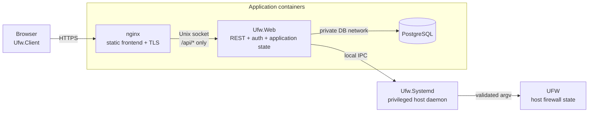

# UFW WebUI Architecture

UFW WebUI is split around one central boundary: network-facing application code does not execute privileged firewall commands. The browser and web application provide management workflows, while a small host daemon owns UFW integration and independently authorizes every privileged mutation.

This document explains that system model, how state is owned, and how the major components interact. Protocol encoding details live under [Protocols](../protocols/README.md), and host-specific operational steps live under [Deployment](../deployment/deployment.md).

## System model

A production deployment has four runtime roles. Three are unprivileged application processes; the fourth is the privileged daemon on the firewall host.

The public HTTP endpoint is nginx. It serves the independently built WebAssembly application and proxies only `/api/*` to `Ufw.Web`. `Ufw.Web` has no public TCP listener in the production Compose topology. `Ufw.Systemd` is not containerized: it runs under systemd so the application stack never needs access to UFW files, netfilter privileges, or the host Docker socket.

The split between nginx and `Ufw.Web` is security-significant. The browser creates privileged mutation signatures, so the code delivered to the browser is part of the signing trusted computing base. Keeping frontend assets in a separate, read-only nginx image prevents a compromised ASP process from replacing the signing application directly.

## Responsibility boundaries

### Browser application

`Ufw.Client` presents firewall state and application metadata, manages the browser side of authentication, validates rule input for usability, and creates signed mutation intents. It talks only to the versioned REST API; it has no knowledge of daemon transports or UFW process execution.

Access JWTs stay in memory. The refresh token is an `HttpOnly` cookie managed by the browser, and mutation private keys are supplied to the signing workflow without being persisted by the application. Appearance and culture preferences are the only browser-local persisted state.

Browser-side rule validation is not an authorization boundary. The daemon repeats semantic validation and reconstructs the canonical signed representation before it accepts a mutation.

### Web application

`Ufw.Web` owns HTTP concerns: API authentication, user/session state, application metadata, PostgreSQL persistence, and adaptation between REST and the local daemon protocol. It can ask the daemon to list state or submit a signed mutation, but it cannot manufacture mutation authority.

The web application intentionally does not maintain a second firewall model in PostgreSQL. Its database contains ASP.NET Core Identity data, refresh-token families, and application-owned metadata such as network-interface comments and visibility preferences.

Database-backed workflows use request-scoped transactions. Authentication operations are coordinated as one transaction so Identity state and refresh-token state commit or roll back together. Expected authentication failures can still commit security state, for example failed-login counters or refresh-family revocation.

### Privileged daemon

`Ufw.Systemd` is the host security boundary. It owns daemon IPC routing, authorized mutation keys, replay protection, deployment identity, authoritative UFW observation, host-interface validation, and the subprocess boundary.

The daemon exposes read operations for rules, network interfaces, and intent context. Add, ordered insertion, delete, and reorder operations additionally cross signed-intent verification before they can reach the UFW execution gate. IPC peer identity and web authentication are defense in depth, not substitutes for this authorization check.

All UFW activity is serialized inside the daemon. A mutation retains the execution gate through current-state checks, process completion, and post-operation reconciliation. Once a child process starts, cancellation does not abandon it: the daemon retains ownership until the child exits or is terminated and reaped, reconciles authoritative state, and only then completes the request.

### Shared contracts

`Ufw.Shared` contains concepts that must mean the same thing on both sides of a process boundary: firewall rule semantics, normalization and rendering, signed-intent primitives, IPC message contracts, and protocol serialization metadata. It does not own runtime policy for either the browser, web application, or daemon.

`Ufw.Ipc.Client` implements the typed daemon client used by `Ufw.Web`. The daemon route/serialization infrastructure is supported by `Ufw.Roslyn` and its source generator so production routing and protocol metadata can remain compatible with NativeAOT.

## State ownership

The architecture distinguishes authoritative state from caches and presentation metadata. That distinction is what allows UFW to remain editable outside this application.

| State | Owner | Notes |
| --- | --- | --- |
| Firewall rules and UFW enabled state | UFW, observed through `Ufw.Systemd` | Never reconstructed from PostgreSQL |
| Current host network interfaces | Host OS, observed through `Ufw.Systemd` | Re-read for add-rule validation |
| Authorized mutation public keys | `Ufw.Systemd` operator state | Not writable through the web API |
| Signed-intent replay records and deployment identity | `Ufw.Systemd` | Persisted across daemon restarts |
| Active reorder recovery journal | `Ufw.Systemd` | Durable safety record while a delete/reinsert move may be incomplete |
| Users, refresh-token families, interface metadata | `Ufw.Web` / PostgreSQL | Application state only |
| Access token | Browser memory | Short-lived bearer credential |
| Mutation private key | Administrator/browser signing workflow | Never sent to the server or persisted by the application |
| Production frontend assets | nginx image | Built/deployed independently from ASP |

When application metadata and host state disagree, host state wins. Reconciliation may preserve metadata for objects that still exist, but metadata cannot create a firewall rule or make a nonexistent interface valid.

## Primary request flows

### Reading firewall state

The browser calls the authenticated REST API, `Ufw.Web` sends a typed local IPC request, and the daemon reads `ufw status numbered` while holding the UFW execution gate. Supported rows are parsed into the shared semantic rule model and receive stable semantic identities. Rows the parser cannot understand completely remain visible as raw state but do not receive a mutable identity.

The browser treats each successful response as an authoritative snapshot. If a later refresh fails, the previous snapshot may remain visible as stale information, but mutation controls are disabled until a fresh authoritative read succeeds.

### Mutating firewall state

A firewall mutation uses two independent authorization layers. The HTTP request requires a valid web session, and the mutation body carries a browser-created signature that the daemon verifies independently.

The browser first obtains the daemon's intent context and signs an operation-specific canonical payload with an authorized P-256 key. Append add binds normalized rule semantics; delete also binds the semantic rule identity. Ordered insertion binds the normalized new rule, a SHA-256 fingerprint of the exact ordered snapshot displayed by the browser, one snapshot-local anchor occurrence, and before/after placement. Reorder binds the same kind of exact snapshot fingerprint plus the complete desired occurrence permutation. `Ufw.Web` forwards the signed envelope without becoming mutation authority. The daemon verifies deployment scope, operation, payload semantics, signature, and freshness before entering the serialized mutation boundary, then durably consumes the nonce and reconciles every privileged UFW effect against fresh authoritative state.

See [Firewall model](firewall-model.md) for state reconciliation and [Signed mutation intent v2](../protocols/signed-intent.md) for the exact signed contract.

### Managing network-interface metadata

The daemon exposes the host's current interface names as an unsigned read operation at the mutation-protocol layer. `Ufw.Web` can explicitly reconcile that host inventory into PostgreSQL, preserving application-owned comments and visibility flags for names that still exist.

The cached inventory is an authoring aid, not firewall authority. Selecting an interface in the UI writes the real interface name into the rule. Immediately before an add or ordered-insertion operation executes, the daemon independently verifies that every referenced interface still exists on the host. Deletion remains possible after an interface disappears so stale firewall rules do not become undeletable.

### Authenticating the web session

Users authenticate against ASP.NET Core Identity. Successful login returns a short-lived ES256 access token and sets a rotating opaque refresh token in a `Secure`, `HttpOnly`, `SameSite=Strict` cookie. Only refresh-token hashes are persisted.

Refresh tokens belong to families and rotate on use. Replay of a revoked token invalidates remaining active members of the family. The browser serializes login, refresh, and logout operations across same-origin tabs so two tabs do not race to consume the same rotating cookie.

Web authentication controls REST access. It is deliberately separate from daemon mutation authorization.

## IPC boundary

`Ufw.Web` and `Ufw.Systemd` communicate over a connection-oriented local stream. Linux production uses a group-restricted Unix-domain socket; development can use the corresponding local named-pipe abstraction. Optional TLS or mTLS can wrap that stream.

The protocol is layered so each level owns one kind of compatibility decision:

1. the stream establishes ordered byte transport and optional TLS;
2. ITP frames and bounds one application message;
3. the application protocol validates request/response envelope semantics;
4. daemon routing binds a valid request to a typed endpoint.

Each connection carries one request/response exchange. There is no long-lived IPC session, multiplexing, or request correlation state. Expected peer and protocol failures are contained to the current connection; unexpected daemon failures remain visible rather than being silently converted into peer errors.

See [IPC protocols](../protocols/README.md) for the wire contracts.

## Project structure

The source tree follows deployment and responsibility boundaries rather than mirroring individual screens or endpoints.

| Project | Architectural role |
| --- | --- |
| `Ufw.Client` | browser application and REST client |
| `Ufw.Web` | web/API application and PostgreSQL-backed application state |
| `Ufw.Systemd` | privileged firewall daemon |
| `Ufw.Shared` | cross-process domain/protocol contracts |
| `Ufw.Ipc.Client` | local typed IPC client |
| `Ufw.Roslyn` / `Ufw.Roslyn.SourceGen` | compile-time routing/serialization support used by the daemon stack |
| `Ufw.Mock` | development substitute for the external UFW executable |

Tests are split along the same boundaries. Shared tests cover firewall/protocol semantics, IPC tests exercise the real client/daemon protocol stack over in-process transport, daemon tests cover authorization and UFW integration behavior, web tests cover persistence and application workflows, and mock black-box tests verify observable CLI compatibility.

## Architectural invariants

The system model depends on five invariants:

- firewall existence and semantics are authoritative in UFW rather than PostgreSQL;
- any mutation that can affect UFW crosses daemon-side authorization, independently of HTTP authentication;
- application metadata can enrich authoring or presentation only after resolving to real firewall semantics before signing;
- unsupported UFW syntax remains visible and read-only until parsing, normalization, identity, signing, and argv rendering agree on its meaning;
- production frontend delivery remains independent from ASP while browser code handles privileged signing material.

Internal classes and service boundaries can evolve without changing these ownership and security properties.
