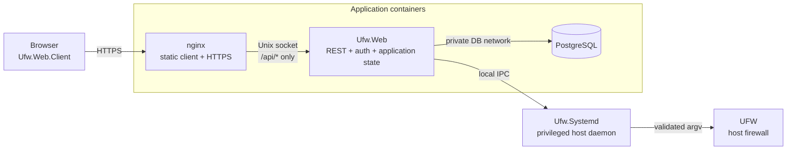
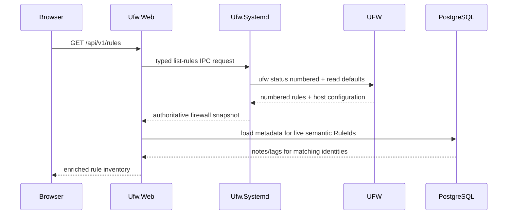
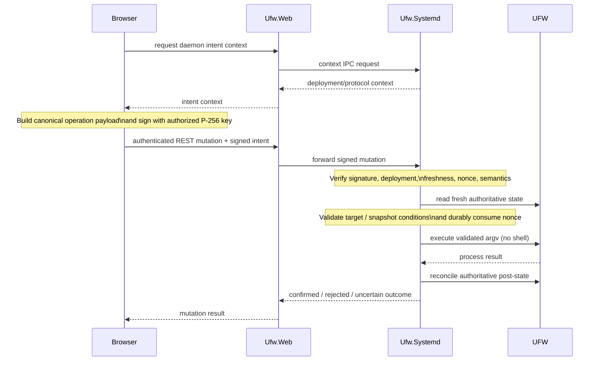

# UFWeb Architecture

UFWeb manages UFW on a host through a web application without making the web tier the firewall authority. The architecture follows from three constraints:

1. **UFW remains authoritative.** Administrators may continue to use the normal UFW CLI or other host tooling. UFWeb must observe those changes rather than reconstructing firewall truth from its database.
2. **Network-facing code does not execute firewall commands.** The browser and ASP application provide management workflows; a small host daemon owns privileged UFW access.
3. **A web session is not firewall-mutation authority.** Privileged mutations are approved in the browser and independently verified by the daemon before UFW is invoked.

Those constraints shape the deployment topology, state model, request flows, and project boundaries described below. Detailed rule semantics live in [Firewall state and rule model](firewall-model.md), the trust model in [Security architecture](security.md), and wire-level contracts under [IPC protocols](../protocols/README.md).

## System topology

A production deployment has five UFWeb runtime components around UFW itself:

nginx is the only public application endpoint. It terminates browser TLS, serves the independently built WebAssembly application, and proxies `/api/*` to `Ufw.Web` over a private Unix socket. `Ufw.Web` has no public TCP listener in the production Compose topology, and PostgreSQL is reachable only from the web application on an internal container network.

`Ufw.Systemd` runs directly on the firewall host under systemd. It is not containerized and is the only UFWeb component that executes UFW. The container stack therefore needs neither netfilter privileges, UFW files, the host Docker socket, nor write access to daemon authorization state.

Separating nginx from ASP is also part of the mutation trust model. Browser code constructs and signs privileged requests, so the delivered frontend artifact belongs to the signing trusted computing base. Serving it from a separate read-only image means compromise of `Ufw.Web` alone does not let ASP silently replace the signing client.

## Component responsibilities

The runtime components form a deliberate chain from presentation to privileged execution. Each layer owns one kind of state or policy and delegates the rest.

### Browser application

`Ufw.Web.Client` owns presentation and browser-local workflow state. It authenticates to the REST API, loads authoritative firewall snapshots, combines those snapshots with application metadata for presentation, validates rule input for usability, and creates signed mutation intents.

The client talks only to HTTP resources exposed by `Ufw.Web`; it does not know how the daemon transport or UFW subprocess works. Versioned REST DTOs live in the shared `Ufw.Web.Model` assembly so browser and ASP compile against the same wire shape.

Access JWTs remain in memory. The refresh token is an `HttpOnly` browser cookie. Administrator mutation private keys are supplied to the signing workflow for individual operations and are not persisted by UFWeb. Appearance and culture preferences are the only browser-local persisted application state.

Browser validation is convenience and early feedback, not authorization. The daemon validates signed semantics independently before privileged execution.

For the client's internal layering, inventory/query model, and UI interaction boundaries, see [Browser application architecture](browser-application.md).

### Web application and PostgreSQL

`Ufw.Web` owns HTTP authentication, session state, application persistence, REST resources, and adaptation between browser HTTP calls and the daemon IPC protocol. It can list firewall state and forward a signed mutation, but it cannot manufacture daemon-approved mutation authority.

PostgreSQL stores only application-owned state:

- ASP.NET Core Identity users and account state;
- refresh-token families;
- known-host aliases used during authoring/search;
- reconciled network-interface comments and visibility preferences;
- rule notes and reusable tags attached to semantic rule identities.

It does **not** store a second copy of the live firewall rule set. A database record referring to a rule is presentation metadata, not evidence that the rule still exists in UFW.

Database entities use ordinary numeric surrogate keys internally. API-visible application entities use UUIDv7 public IDs so persistence keys do not leak through REST contracts. Related Identity/application updates share transactional boundaries where partial commit would violate the workflow, while expected security failures may still persist security-relevant state such as failed-login counters or refresh-family revocation.

### Privileged daemon

`Ufw.Systemd` is the host firewall security boundary. It owns:

- daemon IPC routing and request validation;
- authoritative UFW observation and parsing;
- current host-interface observation;
- authorized mutation public keys;
- signed-intent verification, freshness, and replay protection;
- deployment identity and reorder recovery state;
- serialization of UFW reads/writes;
- rendering validated UFW argv and owning the child-process lifecycle.

Read requests can establish daemon liveness, current rules/configuration, network interfaces, and signing context. Add, ordered insertion, delete, and reorder additionally cross signed-intent authorization before entering the UFW execution gate.

The daemon keeps ownership of a started UFW child through exit or cancellation cleanup and reconciles the resulting firewall state before completing the request. A successful process exit is therefore not, by itself, proof that a mutation completed as intended.

### Shared contract assemblies

Two shared assemblies keep cross-process meanings stable without merging application responsibilities:

- `Ufw.Shared` contains firewall semantics, normalization/rendering, signed-intent primitives, IPC contracts, and lower-level protocol serialization metadata used across the browser/web/daemon boundaries.
- `Ufw.Web.Model` contains pure `V{N}` REST request/response DTOs shared by `Ufw.Web` and `Ufw.Web.Client`. It may use lower-level `Ufw.Shared` contract types but does not depend on ASP persistence/services or client feature/UI code.

`Ufw.Ipc.Client` implements the typed daemon client used by `Ufw.Web`. `Ufw.Roslyn` and `Ufw.Roslyn.SourceGen` provide runtime contracts plus compile-time routing/serialization bindings so daemon dispatch and JSON metadata stay explicit and NativeAOT-compatible. See [Compile-time routing and serialization](source-generation.md).

## State ownership

UFWeb's most important architectural distinction is between **authoritative host state**, **application-owned state**, and **derived browser presentation**. Keeping those categories separate is what allows out-of-band UFW administration to coexist with the web interface.

| State | Owner | Contract |
| --- | --- | --- |
| Firewall rules, active state, IPv6 capability, default policies | UFW, observed through `Ufw.Systemd` | Authoritative; never reconstructed from PostgreSQL |
| Current host network interfaces | Host OS, observed through `Ufw.Systemd` | Authoritative host inventory; checked again before rule creation/insertion |
| Authorized mutation public keys | daemon/operator state | Not writable through REST |
| Replay records and deployment identity | `Ufw.Systemd` | Durable across daemon restarts |
| Reorder recovery journal | `Ufw.Systemd` | Temporary durable safety state while a delete/reinsert move may be incomplete |
| Users and refresh-token families | `Ufw.Web` / PostgreSQL | Web-session state only |
| Known-host aliases | `Ufw.Web` / PostgreSQL | Authoring/search convenience; resolves to literal addresses before signing |
| Interface comments/visibility | `Ufw.Web` / PostgreSQL | Metadata over reconciled host interface names |
| Rule notes and tags | `Ufw.Web` / PostgreSQL | Presentation metadata keyed by semantic rule identity; not firewall existence |
| Access JWT | browser memory | Short-lived HTTP credential |
| Mutation private key | administrator/browser workflow | Never sent to ASP/daemon or persisted by UFWeb |
| Rule filtering, match evidence, ordering preview | browser | Derived from the currently loaded authoritative snapshot and application metadata |
| Production frontend assets | nginx image | Built and deployed independently from ASP |

This ownership model gives each kind of metadata a different lifecycle. Interface metadata can be reconciled with current host inventory. Known-host aliases are entirely ASP-owned and require no daemon reconciliation. Rule metadata is shown only when its semantic identity is live; if a rule disappears out-of-band, the metadata remains stored but unmatched until an explicit operator-reviewed cleanup.

## Reading firewall state

The rule-list path is the foundation for most management workflows:

The daemon runs UFW under a deterministic locale and reads the required UFW defaults while holding its execution gate. Fully understood rows become normalized structural rules with semantic identity. Rows that cannot be understood completely remain visible as opaque state but are not promoted into mutation targets.

The same snapshot carries UFW active state, IPv6 capability, and incoming/outgoing/routed default policies. If required configuration cannot be established safely, the snapshot read fails rather than publishing a partially authoritative view.

`Ufw.Web` enriches that snapshot with notes/tags only for semantic identities that are live in the daemon response. Listing is side-effect free: observing a new UFW rule does not create database metadata, and observing that a rule disappeared does not delete retained metadata.

The browser treats a successful response as one authoritative point-in-time inventory. If a later refresh fails, it may keep the previous snapshot visible as stale information, but mutation controls remain disabled until a fresh authoritative inventory is available. IPv4 and IPv6 are presented separately because UFW evaluates them as independent ordered rule sets even though numbered output concatenates the two families.

## Presenting and enriching rules

The browser derives presentation from the loaded inventory instead of mutating authoritative data in-place. Family partitioning, user-visible family positions, sorting/query evaluation, known-host context, canonical command text, and match evidence are projections over the current snapshot plus ASP-owned metadata.

Filtering is deliberately client-side for the current rule inventory. Structured filters cover rule action, direction, protocol, source/destination networks and ports, interfaces, tags, and text-oriented fields. Free-text search also considers comments, notes, tags, canonical UFW syntax, and compatible known-host aliases. Match evidence records why a row matched so the UI can show context without changing rule semantics.

Filtering and ordering-preview are mutually exclusive interaction modes. A filtered view is not a complete ordered firewall list, so drag/drop and other reorder controls are disabled while query constraints are active. The daemon still receives combined-snapshot coordinates/fingerprints for state-conditioned mutations; family-local browser positions are presentation coordinates only.

Rule metadata follows the semantic rule rather than a particular UFW display number. Notes and tag UUIDs can be updated without a firewall mutation, but `Ufw.Web` first confirms that the target semantic identity is live in a fresh daemon snapshot. For newly created rules, the firewall mutation completes first; optional metadata is attached afterward, and metadata failure cannot rewrite a confirmed firewall mutation as failed.

See [Browser application architecture](browser-application.md) for the client-side state/projection model and [Firewall state and rule model](firewall-model.md) for semantic identity and family ordering.

## Mutating firewall state

A firewall mutation crosses two independent authorization planes: the browser must have an authenticated web session, and the daemon must verify a browser-created signed intent for the exact privileged operation.

The signed payload depends on the operation. Append add binds normalized rule semantics. Delete also binds semantic rule identity. Ordered insertion and reorder additionally bind the exact reviewed snapshot through a fingerprint and use occurrence coordinates whose meaning exists only inside that snapshot. The daemon never accepts browser/ASP-provided raw UFW argv.

Fresh-state checks happen inside the serialized daemon execution boundary. Replay state is persisted before a mutating subprocess starts. After execution, the daemon re-lists UFW and reports success only when the expected authoritative result can be established. Reorder has an additional durable recovery journal because moving an existing row requires a delete/reinsert sequence that can be interrupted between commands.

Detailed identity, duplicate, insertion, reorder, cancellation, and uncertain-outcome behavior is documented in [Firewall state and rule model](firewall-model.md). Cryptographic and trust guarantees are documented in [Security architecture](security.md) and the exact signed wire contract in [Signed mutation intent v2](../protocols/signed-intent.md).

## Application-owned authoring context

UFWeb keeps authoring conveniences outside the firewall contract until they resolve to concrete firewall semantics.

### Network interfaces

The daemon exposes current host interface names. `Ufw.Web` can reconcile that inventory into PostgreSQL while retaining comments and visibility preferences for names that still exist. The browser then uses those entries while authoring rules.

The cached metadata is only an authoring aid. A selected interface becomes its literal host interface name in the rule, and the daemon checks interface existence again immediately before add or ordered insertion. Delete intentionally does not require the interface to remain present so stale rules can still be removed.

### Known hosts

Known hosts are ASP-owned aliases for one canonical IPv4/IPv6 address or CIDR plus a name, optional comment, and visibility preference. They are suggestions, not firewall objects. Choosing an alias writes the literal address/network into the rule; alias IDs/names/comments never enter the signed mutation, daemon protocol, or UFW command.

The same catalog contributes context to source/destination filtering and free-text search. That projection is presentation-only: changing or deleting an alias cannot change a live firewall rule. Alias address family is stable for the lifetime of the alias so one persistent application identity cannot silently switch between IPv4 and IPv6 meaning.

### Rule metadata

Rule notes and tags are presentation metadata keyed by opaque semantic `RuleId`. Reusable tags have stable UUIDv7 identity independent of display name/color, allowing loaded metadata and active tag filters to reconcile after a tag is renamed or recolored.

If a rule disappears outside UFWeb, normal reads simply stop joining its metadata. The metadata-management workflow can later compare stored records with a fresh authoritative snapshot and present unmatched records for explicit cleanup. Cleanup rechecks authoritative state before deleting the selected metadata so a semantically recreated rule regains its retained notes/tags instead of having them removed accidentally.

## Authentication and operational status

Web authentication is separate from mutation authorization. `Ufw.Web` uses ASP.NET Core Identity, short-lived ES256 access tokens, and rotating opaque refresh tokens stored as `Secure`, `HttpOnly`, `SameSite=Strict` cookies. Only refresh-token hashes are persisted. Reuse of a revoked refresh token invalidates the remaining active members of its family, and the browser serializes login/refresh/logout across same-origin tabs so they do not race to rotate the shared cookie.

Operational status also keeps boundaries explicit instead of inferring health from unrelated requests:

- `GET /api/health` probes the `Ufw.Web` management process;
- `GET /api/v1/status` crosses ASP and local IPC to a dependency-free daemon status endpoint;
- `GET /api/v1/rules` exercises authoritative UFW observation;
- `GET /api/v1/intent/context` exercises mutation-context state but does not define daemon liveness.

A successful downstream probe does not overwrite a failed upstream result, and an upstream failure does not imply that an untested downstream component is unavailable. The status UI therefore reflects which boundary was actually observed.

## IPC boundary

`Ufw.Web` and `Ufw.Systemd` communicate over a connection-oriented local stream. Production uses a group-restricted Unix-domain socket; development can use the corresponding platform local-pipe abstraction. Optional TLS/mTLS can wrap the stream without replacing signed mutation authorization.

The protocol stack separates transport framing from application semantics:

1. the local stream provides ordered bytes and optional TLS;
2. ITP frames and bounds one application message;
3. the application protocol validates request/response envelopes and payload metadata;
4. daemon routing binds a valid request to a typed endpoint.

Each connection carries one request/response exchange. There is no long-lived IPC session or multiplexed correlation state. Expected peer/protocol failures are contained to the current connection; unexpected daemon failures remain visible.

See [IPC protocols](../protocols/README.md) for the exact contracts.

## Source and dependency structure

The solution follows process and contract boundaries rather than the page tree:

| Project | Architectural role |
| --- | --- |
| `Ufw.Web.Client` | browser application and REST clients |
| `Ufw.Web.Model` | shared pure/versioned REST DTOs |
| `Ufw.Web` | authenticated REST API and PostgreSQL-backed application state |
| `Ufw.Systemd` | privileged firewall daemon |
| `Ufw.Shared` | cross-process firewall/security/IPC contracts |
| `Ufw.Ipc.Client` | typed local IPC client used by ASP |
| `Ufw.Roslyn` / `Ufw.Roslyn.SourceGen` | compile-time daemon routing/serialization contracts and generators |
| `Ufw.Mock` | development/test substitute for the external UFW executable |

Inside `Ufw.Web.Client`, the dependency direction is similarly explicit: `Api` owns HTTP access, `Features` owns client-side domain/application behavior, `Services` contains genuinely domain-agnostic browser services, `UI` owns Razor presentation, and `Configuration` owns immutable runtime configuration. Shared REST DTOs remain outside that assembly in `Ufw.Web.Model`.

Tests follow the production boundaries. Shared tests cover firewall/security/protocol semantics; IPC tests exercise the typed client and daemon protocol stack over in-process transport; daemon tests cover authorization and UFW integration; web tests cover persistence/auth/application workflows; client tests cover browser policy/projections/services; and mock black-box tests verify observable CLI compatibility.

## Architectural invariants

The implementation can evolve while preserving these system-level contracts:

- UFW and host configuration remain authoritative for live firewall semantics; PostgreSQL never becomes a shadow firewall database.
- Every operation that can change UFW crosses daemon-side signed authorization independently of REST authentication.
- Authoring metadata resolves to literal firewall semantics before signing; presentation metadata never becomes mutation authority.
- UFW display numbers and browser family positions are presentation coordinates, not durable rule identity.
- Unsupported rule syntax remains visible but read-only until parsing, normalization, identity, signing, and argv rendering agree on its semantics.
- Started daemon subprocesses remain owned through completion/cancellation cleanup and authoritative reconciliation.
- Production frontend delivery remains independent from ASP while browser code handles privileged signing material.
- Derived client projections such as filtering, match evidence, and ordering preview never overwrite the authoritative firewall snapshot they were derived from.

These invariants are the compatibility boundary for architectural changes. Internal classes and service decomposition may change without changing the system model above.
