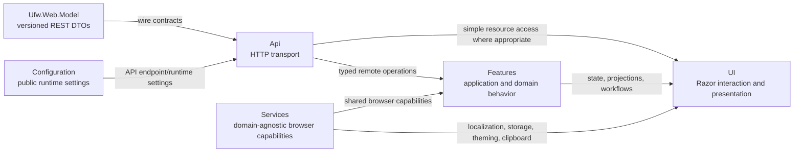

# Browser Application Architecture

`Ufw.Web.Client` is a Blazor WebAssembly application, but its architectural boundary is not the Razor component tree. The client is organized so transport, application behavior, reusable browser services, runtime configuration, and presentation can evolve independently while all firewall authority still comes from server/daemon snapshots.

The central rule is that the browser may derive, stage, and present state, but it does not invent authoritative firewall state. A fresh rule inventory is the input to family presentation, filtering, ordering preview, metadata enrichment, and mutation signing. Those browser-side projections can make the data easier to work with, but they never replace the snapshot from which they were derived.

## Client structure and dependency direction

The project has five top-level areas:

```text
Ufw.Web.Client/
  Api/             HTTP clients and generic REST mechanics
  Configuration/   immutable browser runtime configuration
  Features/        client-side domain/application behavior
  Services/        domain-agnostic browser/application services
  UI/              Razor presentation and styles
```

The directory split is also a dependency boundary. Transport contracts and browser-wide capabilities flow inward toward application behavior and presentation; feature code does not reach back into Razor types simply because a workflow happens to be initiated by a page.



The shared `Ufw.Web.Model` project sits outside the client and contains pure, versioned REST DTOs consumed by both ASP and Blazor. Keeping those models outside `Api` is deliberate: the client owns how it calls the REST API, but it does not own the wire contract by itself.

`Api` is therefore a transport boundary rather than an application layer. Its resource namespaces mirror the browser-visible ASP resources such as authentication, intent context, rules, rule metadata, tags, known hosts, network interfaces, and status. Typed API clients know how to serialize a request, send it, and interpret protocol-level failures. They do not decide how an uncertain mutation changes page state, how a reorder preview should be reconciled, or how several API calls combine into one user workflow.

Those decisions belong to `Features`. Features are grouped by domain and turn transport data into browser-side behavior. Authentication, known hosts, network interfaces, status, and rules each own the services and state transitions specific to that domain. The rules feature is intentionally subdivided further because authoring, filtering, insertion, intent signing, metadata, ordering, presentation, and page projections are independently testable concerns. When behavior can be expressed without Razor lifecycle or DOM access, it belongs here rather than in component code-behind.

`Services` is smaller and deliberately domain-agnostic. Clipboard access, browser storage, localization, theming, and generic client error mapping fit here because several features or UI surfaces can use them without giving them firewall-specific meaning. A service should not move into this namespace merely because it is registered with dependency injection.

`UI` contains `App`, layouts, pages, reusable Razor components, and their styles. It depends on API, feature, and generic service abstractions and translates their state into interaction and presentation. The filtering UI illustrates the intended direction: filter semantics and evaluation live in `Features.Rules.Filtering`, while the catalog that maps a filter kind to a Razor editor and human-facing label lives under `UI.Components.Rules.Filtering`. Feature code therefore never needs to reference component types.

`Configuration` is the remaining root because browser runtime settings are neither domain behavior nor a service. It contains immutable public settings such as the resolved API base address. Browser configuration is observable by the user and must not contain secrets.

## Authoritative inventory and interaction state

The rules and create-rule pages share an explicit inventory model for the currently loaded firewall snapshot. The model distinguishes initial loading, refresh in progress, a fresh usable snapshot, a stale snapshot retained after a failed refresh or uncertain mutation, and a terminal load failure. That distinction exists because “we still have data to show” and “this data is safe to use as mutation authority” are different statements.

When a REST rule-list response succeeds, the browser constructs a `RuleSnapshot` from daemon-authoritative firewall state plus the application metadata joined by `Ufw.Web`. Later UI operations derive views from this snapshot rather than rewriting it. If a refresh fails, the previous snapshot can remain on screen as useful stale information, but mutation controls stay disabled until a fresh inventory has been established again.

The rules page separately tracks transient interaction state such as metadata editing, deletion confirmation, and application of a staged reorder. Keeping this state machine separate from inventory freshness prevents UI workflow flags from accidentally becoming evidence that firewall state is current. It also makes impossible combinations explicit: a page should not be “deleting” and “editing metadata” at the same time, and finishing a dialog does not by itself make a stale firewall snapshot fresh.

## Family projection and ordering

UFW evaluates IPv4 and IPv6 as separate ordered rule sets even though its numbered status output presents them in one combined sequence. The browser therefore projects one authoritative snapshot into family-specific workspaces. User-visible positions are one-based within the selected family; combined UFW numbering remains snapshot/protocol data used where the daemon must address the underlying CLI.

Reordering starts as a browser-local preview over that family projection. Dragging a rule changes only the derived order the user is reviewing; it does not mutate the authoritative `RuleSnapshot`. Applying the preview signs the complete desired occurrence order together with the fingerprint of the exact authoritative baseline. Discarding it simply removes the derived preview and reveals the unchanged source snapshot again.

Ordered insertion uses the same principle. Navigating from a particular row can carry snapshot-local insertion context into the create-rule workflow, allowing the UI to show “before” or “after” relative to the reviewed row. The eventual signed request still binds that anchor to the exact snapshot in which the occurrence number had meaning, so a later out-of-band change cannot silently retarget the insertion.

## Query and filtering pipeline

Filtering is a composable client-side projection over the current family workspace. `RuleQuery` contains independent `RuleFilter` instances rather than one monolithic predicate, which lets filters be added, edited, removed, and combined without coupling unrelated semantics. The current filters cover action, direction, protocol, source and destination networks, source and destination or general port expressions, interfaces, reusable tag identity, and free-text search.

Address matching is CIDR-aware, and filter editors use the selected rule family so IPv4 and IPv6 validation remains explicit. Known-host aliases can contribute human-facing context to an address field, but the filter still evaluates the underlying canonical address/network rather than turning the alias into part of firewall identity.

Free-text search operates on a dedicated presentation/search projection instead of rendered HTML. Searchable content includes structural rule fields, comments, rule notes, tag names, canonical UFW command text, and compatible known-host aliases. Each filter produces structured match evidence, so the UI can explain that a row matched a note, tag, interface, address alias, or command fragment without reimplementing search rules inside Razor.

Filtering and ordering preview are intentionally mutually exclusive. A filtered result is only a subset of the ordered family and therefore cannot provide an unambiguous drag/drop coordinate system. Conversely, changing the query while a reorder is staged would change the projection the user is reviewing. The interaction state enforces this at the workflow level rather than relying on each control to rediscover the invariant independently.

## Metadata, known hosts, and interfaces

Rule metadata consists of optional notes and reusable tags attached to semantic rule identity. The same metadata editor can be used while editing an existing live rule or while preparing a new rule, but persistence follows firewall authority in different orders. For an existing rule, `Ufw.Web` confirms that the semantic identity is still live before saving metadata and the browser then reconciles the returned metadata into its loaded snapshot. For a new rule, the signed firewall mutation is confirmed first; only after the resulting semantic identity is known does the browser attach the prepared metadata. If that second request fails, the UI can report a metadata problem without misrepresenting the successful firewall mutation.

Tags have stable UUID identity independent of their display name or color. Renaming or recoloring a tag can therefore update loaded metadata and active tag filters without changing what those filters refer to. The tag chip itself is a shared visual component across list, detail, editor, and preview surfaces, so the preview is not a second approximation of the persisted rendering.

Known hosts and network interfaces both assist rule authoring, but their authority differs. Known hosts are ASP-owned aliases that resolve immediately to one literal canonical address or network. They can be cached for completion and search context because changing an alias cannot alter a firewall rule that already contains only the resolved literal value.

Network interfaces originate from the host instead. `Ufw.Web` reconciles daemon-observed interface names with application metadata such as comments and visibility, and the browser uses that enriched inventory for suggestions. The daemon still checks the literal interface name against fresh host state immediately before add or ordered insertion, so a stale browser cache can never authorize use of an interface that no longer exists.

## Authentication and HTTP coordination

The authentication feature keeps the short-lived access token in memory and coordinates login, refresh, and logout across same-origin tabs. HTTP handlers attach bearer credentials where required and perform the controlled one-time refresh/replay behavior needed by the rotating refresh-cookie model. This coordination lives below Razor pages because token rotation is application behavior, not presentation behavior.

Pages and components therefore react to authentication state and invoke feature/API abstractions; they do not construct authorization headers or resolve refresh races themselves. The same separation applies to errors: transport failures are interpreted at the API boundary, feature services decide what they mean for application state, and the UI decides how that state should be presented to the user.

## Presentation and styling ownership

Razor pages coordinate lifecycle and user interaction, but reusable domain behavior should not accumulate there merely because a workflow starts from a page. Page code-behind is appropriate for component lifecycle, navigation, dialog composition, and other UI-specific coordination. Projection, validation, signing, mutation reconciliation, and similar behavior that can be tested without a renderer belongs in feature services.

Styles follow the same ownership principle. Component- and page-specific Sass is colocated with the Razor owner. CSS isolation is an opt-in for components that genuinely own the DOM they style; components that intentionally target MudBlazor-generated descendants, portal content, or shared framework markup use colocated global Sass instead of escaping isolation through pervasive `::deep`. The concrete source and Sass conventions are documented in [Client UI development](../development/client-ui.md).

## What must remain true

The browser can be refactored internally as long as a few boundaries remain intact. An authoritative firewall snapshot stays immutable input to derived presentation state, and a stale snapshot can remain visible without becoming mutation authority. Family-local positions remain presentation coordinates rather than durable identity, while filtering and search remain projections that cannot silently change rule semantics. Authoring conveniences resolve to literal firewall semantics before signing, and application metadata can enrich a live rule but cannot make that rule exist.

At the code-organization level, API clients remain transport adapters rather than workflow services, feature/application code remains independent from Razor component types, and shared REST DTOs remain in `Ufw.Web.Model` instead of drifting into separate browser and ASP copies. These constraints are more important than the exact class or directory names used to implement them.
