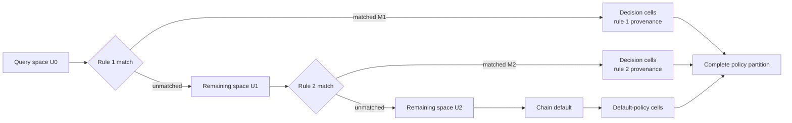

# Semantic Policy Domain

The semantic policy domain is UFWeb's read-only interpretation of normalized UFW rules. It takes the same structural rule semantics used for identity and mutation, combines them with the configured default policies and the finite host/model context needed to interpret `any`, and answers questions about the effective UFW-managed policy over packet space.

This is deliberately different from network reachability. An allowed region means that the modeled UFW user policy permits those packets if they reach that policy. Routing, NAT, connection tracking, service availability, other firewalls, and netfilter rules outside the normalized UFW user-rule surface can still change what happens on the host or network. The [firewall state and rule model](firewall-model.md) remains authoritative for how UFWeb observes and mutates UFW; the policy domain only interprets a supplied snapshot.

## Closed-world policy model

Evaluation operates on one closed policy world for one concrete address family. The caller supplies:

- the normalized rules in authoritative family order;
- the incoming, outgoing, and routed default policies;
- the finite set of known interfaces;
- the supported protocol definitions, including whether source and destination ports apply to each protocol.

IPv4 and IPv6 are separate worlds because UFW evaluates them as separate rule sets. The address universe is the complete selected family, while interfaces and protocols use the finite sets supplied by the caller. A missing rule or query constraint means the complete corresponding domain inside that world; it never means "whatever else may exist on the host."

This closed-world boundary is also the semantic boundary of the evaluator. Connection state, `before.rules`, `after.rules`, NAT, routing, and other state that UFWeb cannot normalize into this model are not inferred or approximated. The UFW active/inactive flag is operational state rather than packet semantics and is therefore not part of a policy world.

Protocol definitions keep protocol membership separate from packet shape. TCP and UDP use numeric source and destination ports. A supported protocol without port semantics instead carries a distinct not-applicable value on those dimensions. A port constraint therefore selects only protocols for which ports exist; an unconstrained query can still cover both port-bearing and portless protocols without inventing combinations such as an ICMP destination port.

The selected traffic chain determines which interface dimensions exist and which default policy resolves unmatched traffic:

| Chain | Interface dimensions | Default policy |
| --- | --- | --- |
| Input | ingress | incoming |
| Output | egress | outgoing |
| Forward | ingress and egress | routed |

For UFW rule projection, inbound `on` maps to ingress, outbound `on` maps to egress, and route rules map their input and output interfaces independently. An interface named by a rule but absent from the supplied interface universe makes that match empty rather than broadening it to `any`.

## Packet space

A policy query constrains any combination of source address, source port, destination address, destination port, protocol, and the interfaces meaningful to its chain. Source and destination constraints are conjunctive: specifying both narrows one packet space rather than invoking a separate pairwise evaluation mode.

### Dimension sets

Each packet dimension is represented as a set relative to the universe supplied by the policy world. Address dimensions use canonical disjoint intervals over the selected IPv4 or IPv6 family, numeric ports use disjoint integer intervals, and protocols and interfaces use finite sets. A missing query or rule constraint means the whole universe for that dimension rather than a special wildcard value.

Port dimensions also preserve protocol applicability. Port-bearing protocols range over the numeric port universe, while protocols without port semantics use the distinct not-applicable value described above. This keeps combinations that do not represent real packets out of the packet space while allowing the same algebra to operate across the complete protocol universe.

### Regions and set algebra

A packet region is the Cartesian product of one set from every dimension meaningful to the selected chain. A packet space is a disjoint union of those regions. Intersection is therefore computed dimension by dimension, while subtraction may split one region into several disjoint regions without enumerating the packets inside it.

For regions $A = A_1 \times \cdots \times A_n$ and $B = B_1 \times \cdots \times B_n$, the difference can be decomposed along the dimensions as:

$$
A \setminus B = \bigsqcup_{i=1}^{n}
\left(
    \prod_{j < i}(A_j \cap B_j)
    \times (A_i \setminus B_i)
    \times \prod_{j > i} A_j
\right)
$$

Empty pieces are discarded. The remaining pieces are disjoint and cover exactly the part of $A$ outside $B$. Compatible regions can then be coalesced again; when they are policy cells, their decision and provenance must agree as well. This is what lets an earlier rule shadow only one source subnet, port interval, protocol subset, or combination of dimensions while the unaffected remainder continues through later rules.

This representation is independent of firewall actions. Adding another interface or supported protocol changes the closed-world data supplied to evaluation, not the first-match algorithm. Adding a protocol with different port applicability changes its protocol definition rather than requiring a separate evaluator.

## Ordered policy evaluation

Policy evaluation applies one chain of the selected family in authoritative order. At every step only the still-undecided packet space is considered. If rule $i$ matches region $R_i$ and $U_i$ is the space still undecided before that rule, then:

$$
M_i = U_i \cap R_i
$$

is classified by the rule, and

$$
U_{i+1} = U_i \setminus R_i
$$

continues to later rules. This is ordinary UFW first-match behavior lifted from individual packets to sets. It naturally handles partial shadowing: an earlier rule can decide only part of a later rule's match while the remainder continues through the chain. After the final user rule, the chain's configured default policy classifies the remaining space.

Rules belonging to other chains are skipped without changing the relative order of the rules that do participate. `Allow`, `Deny`, and `Reject` are terminal decisions. `Limit` remains a distinct terminal classification because the runtime rate state needed to resolve it further is outside the model.

## Policy partitions and provenance

Evaluation returns a complete partition of the queried space. Every packet represented by the query belongs to exactly one result region, result regions do not overlap, and each region carries both its effective decision and the provenance that made that decision final.

Rule provenance contains semantic rule identity plus its occurrence in the family order. This keeps evidence tied to the actual first-match occurrence even when equivalent rules are present. Traffic not claimed by a user rule records the relevant chain default as its provenance. Regions with different provenance remain distinct even when they carry the same decision, so an explanation does not lose the rule responsible for a result.

The partition is intended as the stable input to higher-level analysis. Consumers can narrow an already evaluated result, project dimensions such as source or destination networks, group regions by effective decision or provenance, and compare decision spaces without reimplementing rule semantics. Packet spaces from separately constructed worlds can participate in set comparison when their packet universes are equivalent, which allows policy-equivalence checks such as comparing two different rule orderings while ignoring provenance differences.

## Projection from firewall state

`Ufw.Shared.Domain` does not read UFW, query a database, or discover interfaces. The firewall projection boundary adapts already normalized `Ufw.Shared.Firewall` state into the closed-world model. Other callers can construct the same domain model directly without depending on daemon or browser types.

Projection preserves the authoritative rule order and family semantics. A supported listed rule is normalized and checked against its semantic identity before becoming a domain rule. An opaque row in the family being projected fails the projection because its match cannot be represented safely; silently skipping it would allow later rules or the default policy to claim traffic whose first match is unknown. An opaque row that is known to belong only to the other family does not affect the selected world.

IPv6 projection from an authoritative snapshot also requires IPv6 to be enabled, because disabled IPv6 rules are not part of UFW's active observable rule set. Projection from a hypothetical ordered specification list does not apply that host capability check because it is not describing a current host snapshot.

Comments, display numbers, application metadata, and presentation state do not participate in packet matching. Known interface names matter only because they define the finite interface universe used by `any` and by explicit interface constraints.

## Extension boundary

The generic set algebra and first-match evaluator do not encode specific policy-exploration questions. Source-centric, destination-centric, pairwise, shadowing, and rule-order comparison are consumers of the same partition model rather than separate policy engines.

Extending an existing finite dimension is correspondingly local: a newly known interface expands the interface universe; a newly supported protocol adds a protocol definition; a new terminal action adds another decision label that the evaluator carries through. A genuinely new packet dimension requires the firewall packet layout to expose that dimension, but intersection, subtraction, and ordered evaluation remain unchanged.

Features such as connection-state reasoning, NAT, or arbitrary netfilter chains cross a different boundary. They require both a new semantic dimension or transformation and an authoritative source from which UFWeb can populate it; they cannot be made correct merely by widening one of the existing closed-world sets.
