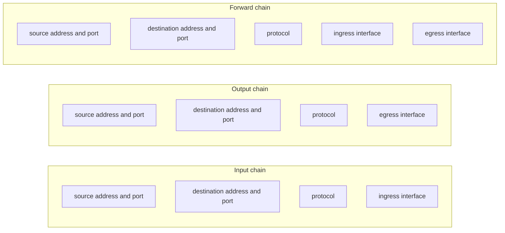
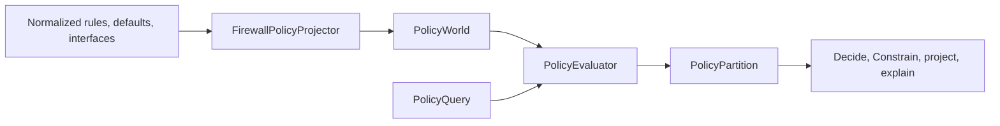

# Semantic Policy Domain

This document describes the read-only policy model in `Ufw.Shared.Domain`: how a normalized UFW rule list becomes a partition of packet space, and which questions that partition can answer. It sits beside the [firewall state and rule model](firewall-model.md). That document defines how UFWeb observes and mutates UFW. This one defines how the same normalized rules are interpreted. Neither one makes PostgreSQL, the browser, or the domain model a second firewall.

The result is a statement about the **modeled UFW user policy**, not about reachability. A region the model allows is not evidence that a packet will arrive. Delivery still depends on routing, topology, whether a service is listening, NAT, other firewalls, kernel connection tracking, and netfilter rules UFWeb does not represent.

## What the model contains

Evaluation reads one closed world:

- the ordered rules of one address family, already normalized;
- the incoming, outgoing, and routed default policies;
- the finite set of known interfaces;
- the finite set of supported protocols.

IPv4 and IPv6 are separate worlds because UFW evaluates them as separate rule sets. A world is pure data. `PolicyEvaluator` does not open a database, call UFW, or know whether the snapshot came from the host daemon or from a hypothetical rule list. `FirewallPolicyProjector` is the adapter that builds a world from `Ufw.Shared.Firewall` types. Another source can build the same world without changing the evaluator.

The configured user policy is what is modeled. The UFW active/inactive flag is operational state and is not an input. Conntrack, `before.rules`, `after.rules`, NAT, and routing are outside the model on purpose: UFWeb cannot authoritatively normalize them into the same rule semantics.

## Closed worlds

Every axis has a universe fixed by the world, not by the addresses or ports that happen to appear in rules. The complement of a match is still in the model and falls through to a later rule or to the default policy.

| Axis | Universe | What an omitted constraint means |
| --- | --- | --- |
| Address | Every IPv4 address, or every IPv6 address | The whole family |
| Port | `1` through `65535`, for every modeled protocol | Every modeled port |
| Protocol | The world's supported protocol set | Every supported protocol |
| Interface | The world's known interface set | Every known interface on that axis |

A rule or query that says "any protocol" therefore means every protocol in the world, not every IP protocol number. ICMP and anything else outside the supported set are simply not in the space being partitioned. The same is true of an interface the world was not told about.

Ports are a single shared axis because every protocol the model can name is port-bearing. Adding another port-bearing protocol is new data in the protocol set. A future protocol that has no ports would be a new axis relationship, not a new name in the existing set.

Which interface axes exist depends only on the chain:

Input has no egress axis and output has no ingress axis. Forward has both. That follows the interface fields UFW user rules can actually name: inbound `on` is ingress, outbound `on` is egress, and a route rule can name `in on` and `out on` separately. A rule that names an interface outside the known set matches no packet. It does not silently become "any interface".

## Packet space

The engine does not enumerate packets. A region is one combinatorial rectangle: a product of one canonical set per axis. Address and port axes are disjoint unions of inclusive integer intervals, so subtracting one CIDR or port range from another does not require expanding either into individual values. Protocol and interface axes are sorted finite sets.

A space is a disjoint union of those rectangles. Intersection, union, and difference are ordinary set operations on that union. Difference of two rectangles uses one fixed decomposition. For a rectangle \(A = A_1 \times \cdots \times A_n\) and a cut \(B\), each piece \(i\) keeps the intersection on the axes before \(i\), the set difference on axis \(i\), and \(A\)'s original set on the axes after \(i\):

$$
A \setminus B = \bigsqcup_i \left( (A_1 \cap B_1) \times \cdots \times (A_{i-1} \cap B_{i-1}) \times (A_i \setminus B_i) \times A_{i+1} \times \cdots \times A_n \right)
$$

Empty pieces are dropped. The pieces are disjoint and cover exactly the tuples of \(A\) that are not in \(B\). Rectangles that share a label and differ in only one axis are coalesced by unioning that axis, so the result stays a short list of set-valued rectangles instead of a list of singleton holes.

`ProductSpace` is the reusable part of this machinery. It does not know what an axis means. The firewall layout is the piece that names axes source, source port, destination, destination port, protocol, and the chain's interfaces. Adding a value to an axis does not change subtraction or coalescing. Adding a new axis is a layout change; the product engine stays as it is.

## Ordered evaluation

A query names the family, one chain, and an optional constraint. A missing component covers that component's whole universe. When source and destination are both present they define one product, not two separate answers. The query rectangle \(U_0\) is the space to be partitioned.

Only rules for the selected chain participate. Their relative order is the order they have in the family list. Rules on other chains are skipped and do not reorder the ones that remain. For each participating rule \(i\), with match rectangle \(R_i\), decision \(a_i\), and provenance \(\pi_i\):

$$
\begin{align*}
M_i &= U_{i-1} \cap R_i \\
U_i &= U_{i-1} \setminus R_i
\end{align*}
$$

\(M_i\) is emitted as one or more cells labeled \((a_i, \pi_i)\) when it is non-empty. After the last rule, whatever remains in \(U_n\) is labeled with the chain's default policy: incoming for input, outgoing for output, and routed for forward.

The decisions are allow, deny, reject, and limit. Limit is terminal for first-match purposes and still conditional: the model does not know the rate or the connection state a live limit rule would consult, so it is not rewritten as allow or deny. Default policies are only allow, deny, or reject, matching what UFW can configure.

Provenance is either a rule or the chain default. Rule provenance carries the opaque rule identity and the rule's zero-based index in the family list. Two textually identical rules therefore stay distinguishable, and the earlier one wins. Cells with the same decision but different provenance are not merged. The partition can explain which rule produced a region, not only whether the region is allowed.

The cells are pairwise disjoint, none is empty, and their cardinalities sum to the cardinality of the query. That cover is checked when the partition is built. Cardinality is an exact integer, including for the full IPv6 space, so the check does not depend on sampling packets.

This is first match inside the modeled user chain. It is intentionally stricter than live netfilter behavior. UFW's `before.rules` accept established and related flows before user rules run. The domain model does not, because connection state is outside its universe. A denied region means "denied if the packet is judged by this user policy", not "dropped on the wire regardless of conntrack".

## Questions after one evaluation

`PolicyPartition` is the value later code should build on. These operations do not re-run first match, because every packet in the original query already has a decision:

- `Decide` returns the cell containing one fully specified packet, or nothing when the packet lies outside the query but still inside the closed world.
- `Constrain` intersects every cell with a tighter constraint and keeps provenance. A UI can narrow a result without a second evaluation.
- `SpaceFor` returns the packets of one decision, or of one provenance, as a set rather than a cover.
- Projections such as `ProjectSourceAddresses` are existential. A value is included when at least one packet in the space uses it. They do not mean the value is allowed for every other field.
- `PolicyAnalysis` answers shadowing from a full-chain partition: a rule is ineffective when its match is empty, fully shadowed when an earlier rule already claimed every packet it could match, and partially shadowed on the set difference between its match and the packets actually attributed to it.

A different rule list or a different default is a different world and needs a new evaluation. A narrower question about the same world does not.

## Projection from firewall state

`FirewallPolicyProjector` is the only type in this namespace that mentions firewall rules. Listed projection takes the authoritative rule list, the configuration snapshot, and the known interface names:

- rows are kept in listed order and then restricted to one observed family; provenance stores that family index, and evaluation walks the same list while skipping other chains;
- an opaque row in the target family fails the projection, because its match is unknown and skipping it would invent a policy;
- an opaque row known to belong to the other family is ignored;
- IPv6 projection fails when the snapshot says IPv6 is disabled, since UFW is not evaluating an IPv6 user chain;
- rule identity is the semantic `RuleId` of the normalized rule, and a listed identity that disagrees with that computation is rejected;
- `any` protocol expands to the supported set, currently TCP and UDP;
- comments and display numbers are not part of the match.

Specification projection takes an ordered list of rule specifications instead of a listing. It is for a hypothetical policy. A family-neutral rule is included in the requested family; a rule of the other concrete family is skipped. It does not consult the IPv6 capability bit, because there is no host snapshot.

Interface fields use the same mapping as command rendering. On input, the destination interface is ingress. On output, the source interface is egress. On forward, the source interface is ingress and the destination interface is egress. UFW text aliases are normalized before parsing, so a bare `0.0.0.0` becomes the whole IPv4 universe rather than the single address zero. The domain parser itself does not apply that alias.

## What can grow without a new engine

The evaluator treats decisions as labels and axes as sets. The following changes stay outside the first-match loop:

| Change | Where it is made |
| --- | --- |
| A new known interface, or a new port-bearing protocol | The world's finite sets, and rules that name them |
| A new terminal action | A new `PolicyDecision` label; evaluation already copies the rule's label through |
| A new question about an evaluated policy | `Decide`, `Constrain`, projections, or `ProductSpace` algebra |
| A new packet axis | The firewall layout that lines axes up; rectangle subtraction is unchanged |

A new axis is still a deliberate model change. Connection state, NAT, and rules outside the parsed UFW user chain are not added by widening one of today's sets. They would need their own universe and a reason to believe UFWeb can populate it authoritatively.
