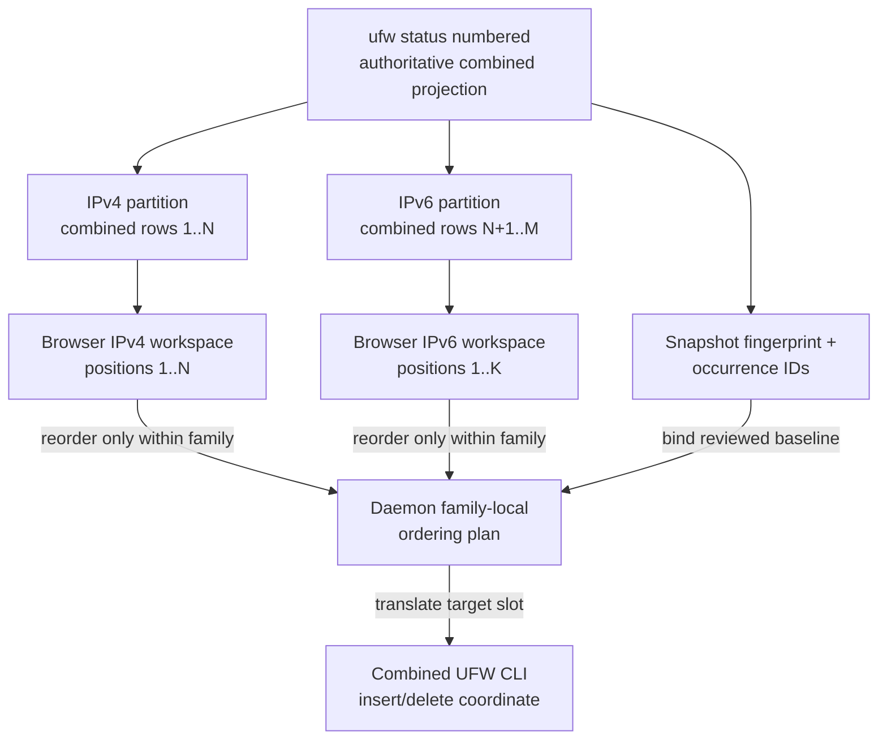

# Firewall State and Rule Model

This document defines the firewall-state contract behind the broader [UFWeb architecture](architecture-overview.md): how UFW output becomes authoritative structural state, how mutable rules are identified, and how add/insert/delete/batch-delete/reorder operations are reconciled against fresh host state.

UFW itself remains the authoritative firewall database. UFWeb does not mirror every rule into PostgreSQL or assume that it is the only actor modifying the firewall, so normal UFW tooling and other administrators can coexist with the web interface without creating two competing sources of truth. The consequence is that every mutable rule must be addressable from current observed firewall semantics rather than from application-generated row numbers or database identifiers.

## Authoritative snapshots

Rule listing reads `ufw status numbered` through the privileged daemon. The daemon runs UFW under a deterministic locale, keeps parseable stdout separate from stderr diagnostics, and parses the complete numbered listing into a snapshot. It also reads the configured UFW defaults file and attaches the effective IPv6 capability plus incoming, outgoing, and routed default policies to that same authoritative response. Failure to read or understand either source fails the snapshot read rather than publishing a partially authoritative configuration.

A snapshot can contain two kinds of rows:

- **supported rows** are fully parsed and pass the same semantic validation required for mutations;
- **opaque rows** remain visible through their raw UFW representation but cannot be mutated by semantic identity.

This distinction is deliberate. Partial parser understanding is sufficient for observability, but it is not sufficient authority to delete or rewrite a firewall rule.

All UFW reads and writes pass through one daemon execution gate. A read therefore cannot observe an intermediate state from a daemon-managed compound operation, and a mutation can compare pre- and post-operation snapshots without another daemon request interleaving.

### Parsing boundary

The daemon parses UFW output and the required settings from its configured UFW defaults file into explicit structural models before any state becomes authoritative. Parsing and semantic validation are separate: a row can be preserved for display even when its structure is not understood well enough to authorize mutation, while required firewall configuration must be understood completely before the daemon publishes a rules snapshot.

The rule-status and defaults grammars share reusable parsing infrastructure, but they produce independent domain models. The defaults reader interprets only the settings needed by the management contract (`IPV6` and the three default policies); unrelated assignments are ignored, while a missing, malformed, or unsupported required value fails the snapshot read.

## Structural rule semantics

Supported rules are represented by normalized firewall semantics rather than by the exact text UFW happened to print. The model contains:

- action: allow, deny, reject, or limit;
- address family;
- direction: inbound, outbound, or forward;
- protocol;
- source and destination addresses;
- source and destination ports;
- directionally meaningful interfaces;
- an optional comment.

Normalization removes textual differences that do not change firewall meaning. All-address forms become `any`, network addresses are canonicalized to their CIDR network boundary, port sets are sorted and merged, and textual fields are trimmed. Direction and interface combinations that would require fallback or precedence interpretation are rejected instead of guessed.

The same normalized model is used for validation, signed intents, semantic identity, duplicate detection, and UFW command rendering. This prevents the user-visible rule, the signed rule, and the executed argv from drifting into separate interpretations.

## Semantic identity

A supported listed rule receives a versioned SHA-256 identity derived from its normalized firewall semantics. Current UFW list numbers and comments are excluded.

The identity exists to answer one question: "which currently observed semantic rule is this?" It is not a persistent application record ID. Equivalent supported textual representations produce the same identity, while IPv4 and IPv6 rules remain distinct.

Delete requests carry both the semantic identity and the complete normalized rule specification. The daemon recomputes the identity from the supplied rule and rejects a mismatch. Under the execution gate it then takes a fresh UFW snapshot, finds current matches, and requires exactly one. Only after that resolution does it use the current UFW display number for the actual delete command.

This protects deletion from ordinary UFW renumbering and from stale browser snapshots. If no current rule matches, or more than one indistinguishable rule matches, the daemon refuses to guess.

## Address-family materialization

Add requests may be family-neutral when their semantic fields do not force IPv4 or IPv6. With IPv6 enabled, UFW materializes such a request into concrete IPv4 and IPv6 rows. With IPv6 disabled, the same family-neutral command is IPv4-only. The daemon therefore reasons about the observable concrete identities that can result from one structural add under the current UFW capability. An explicitly IPv6 add is rejected before a mutating UFW command is issued.

UFW does not retain one cross-family evaluation order. IPv4 and IPv6 rules are stored and evaluated in separate rule sets, and `ufw status numbered` presents them as one deterministic sequence by concatenating the IPv4 partition before the IPv6 partition. Relative placement between an IPv4 row and an IPv6 row therefore has no packet-processing meaning; only ordering within one concrete family affects first-match behavior. The browser reflects that model with separate IPv4 and IPv6 family workspaces and permits reordering only inside the active family. User-facing positions, ordering previews, move targets, and operation reports are one-based within that family. The combined numbered sequence remains authoritative snapshot/protocol data used by signed intents and daemon-side UFW command planning, but it is not exposed as the browser's ordering coordinate.

The same rows therefore participate in two coordinate systems for different reasons. The combined projection is the stable snapshot representation used for fingerprinting and daemon/UFW addressing, while the browser exposes only the family-local order that has actual first-match semantics.

A family-neutral add does not create a durable UFW object linking its two materializations. Once listed, the resulting IPv4 and IPv6 rows are ordinary concrete rules and may also be indistinguishable from rules added independently. The application therefore does not infer or display a synthetic pairing between them; semantic similarity across the two UFW partitions is not evidence of shared identity.

The IPv6 capability is host configuration, not a property inferred from the current rule set. The browser uses the capability from the authoritative rule snapshot to disable IPv6 authoring and IPv6 known-host suggestions, while the daemon independently enforces it for append and ordered-insertion mutations. Per-rule address-family validation remains separate: a structurally IPv6 rule is still IPv6 regardless of whether the current host permits creating it.

Listed rules and delete requests are always family-specific. UFW only loads and reports its IPv6 user-rule file while IPv6 support is enabled. If `IPV6=no`, previously stored IPv6 rules disappear from `status numbered` and are not part of the authoritative rule snapshot; UFW retains the backing IPv6 rule file, so those rows can become observable again if IPv6 is re-enabled. The web interface follows that UFW-visible state rather than inventing mutability for rules the active UFW configuration does not expose.

## Add lifecycle

An accepted add operation follows a conservative sequence:

1. verify the signed intent and enter the daemon execution gate;
2. durably consume the nonce;
3. verify that referenced host interfaces currently exist;
4. read current UFW state and configuration, reject unsupported IPv6 creation, and reject a semantically identical existing rule;
5. render validated argv and start UFW directly, without a shell;
6. retain ownership of the child process through normal exit or cancellation cleanup;
7. read UFW again and require the expected semantic rule to be observable uniquely;
8. report success only after that postcondition is confirmed.

A zero child-process exit code is therefore necessary but not sufficient for success. If UFW reports success but the authoritative post-state cannot be reconciled safely, the daemon reports uncertainty/failure rather than inventing a confirmed rule state.

## Ordered insertion lifecycle

Ordered insertion changes membership and placement together, so it is authorized independently from append-style add and reorder. The browser signs the normalized new rule, the fingerprint of the exact authoritative snapshot being reviewed, one zero-based snapshot-local anchor occurrence, and whether the new rule belongs before or after that anchor. Duplicate semantic anchor rows remain independently addressable because occurrence identity is meaningful only inside the signed snapshot.

The inserted rule must have the same concrete IPv4 or IPv6 family as the parsed anchor. Because UFW does not expose IPv6 rows while IPv6 support is disabled, a valid disabled-IPv6 snapshot cannot provide an IPv6 insertion anchor; client and daemon validation additionally reject such an inconsistent context defensively. Family-neutral ordered creation is intentionally rejected because one UFW command could materialize into multiple concrete rows while one signed anchor identifies only one concrete ordered position. Ordinary append-style add retains family-neutral UFW behavior.

Under the execution gate, the daemon resolves any outstanding reorder recovery obligation, consumes the nonce, re-reads UFW plus its configuration, and requires the current snapshot fingerprint to equal the signed baseline before interpreting the anchor. Referenced interfaces, current IPv6 capability, and duplicate rule semantics are validated using the same authority as append add. `before` targets the anchor position. `after` targets the next occurrence in the same address-family partition, or appends within that concrete family when the anchor is the last occurrence in its partition.

Snapshot occurrences use the combined UFW listing for authorization, and UFW's public `insert N` command also consumes that combined numbered coordinate. The daemon reasons about before/after placement within the anchor's concrete family, then translates the resulting family-local slot back into UFW's combined CLI number immediately before command construction. For IPv6 this adds the current IPv4 rule count because UFW subtracts that prefix internally before mutating its IPv6 rule set. It then executes one insertion and reconciles the complete post-state. Success requires every baseline occurrence to remain in relative order, exactly one requested rule materialization to have been added, and that row to occupy the signed slot. No recovery journal is needed because ordered insertion never removes an existing row.

A verified insertion returns a typed result with the final authoritative snapshot whenever it can be read safely. `Ufw.Web` maps completed execution to HTTP 200, a stale baseline to 409, a precondition failure to 422, and uncertain authoritative state to 503 while preserving the typed report body. Signature, replay, and malformed-intent failures use the normal API error representation.

## Delete lifecycle

Delete follows the same authorization, nonce, process-ownership, and reconciliation rules, with target resolution replacing duplicate detection:

1. take a current snapshot under the execution gate;
2. resolve the signed semantic identity to exactly one current row;
3. use that row's current UFW number for the delete subprocess;
4. re-read UFW and require the semantic identity to be absent before returning success.

Interface existence is intentionally not revalidated for delete. A rule referencing an interface that has since disappeared must still be removable.

## Batch-delete lifecycle

Batch deletion is a state-conditioned mutation over one exact authoritative snapshot. The signed payload contains the snapshot fingerprint and a non-empty set of unique zero-based occurrence IDs from that snapshot. Occurrence IDs, rather than semantic `RuleId`s, are used because duplicate semantic rows can legitimately coexist and must remain independently selectable. The operation is generic firewall authority: an ASP-owned rule-group ID is never part of the signed payload or daemon protocol.

Under the execution gate, the daemon consumes the nonce, reads a fresh snapshot, and requires its fingerprint to match the signed baseline before interpreting any occurrence. Every selected occurrence must fall inside the baseline and have a usable UFW display number. Targets are processed from the highest baseline occurrence downward so deleting one row cannot invalidate the remaining baseline-to-current coordinate mapping by ordinary renumbering.

Before each individual delete the daemon re-reads UFW and requires the complete current rule order to equal the expected surviving subsequence of the signed baseline. It then resolves the selected baseline occurrence to its current row, executes one numbered UFW delete, and reads authoritative state again. A deletion is confirmed only when that post-state equals the expected baseline with exactly that occurrence removed. A non-zero/canceled process can still be classified as a confirmed deletion when the authoritative post-state proves the removal occurred; conversely, a successful process exit is not enough when state does not reconcile.

The operation stops at the first drift, failed postcondition, or unreadable authoritative state. It does not reinsert already deleted rows or otherwise attempt speculative rollback. The structured result therefore separates the overall outcome (`Completed`, `StaleBaseline`, `PreconditionFailed`, `PartiallyCompleted`, or `StateUncertain`) from per-occurrence reports and the still-pending baseline occurrences. A known final snapshot is returned whenever the daemon can establish one safely. Continuing after any non-completed outcome requires a fresh snapshot and newly signed intent.

`Ufw.Web` uses that known final snapshot conservatively when reconciling ASP rule metadata. Only semantic `RuleId`s attached to occurrences that the daemon confirmed deleted are cleanup candidates, and metadata is removed only if the same semantic identity is absent from the final snapshot. Duplicate semantic occurrences therefore retain their shared metadata until the last live occurrence disappears. If no authoritative final snapshot is available, ASP performs no batch metadata cleanup.

## Reorder lifecycle

Reordering is a state-conditioned mutation over the two family-local UFW orders represented by one exact authoritative snapshot. For protocol compatibility, the snapshot keeps UFW's deterministic numbered presentation: all observed IPv4 rows followed by all observed IPv6 rows. The browser computes a versioned SHA-256 fingerprint from the firewall activity flag and that complete projection, and assigns each row a snapshot-local occurrence ID equal to its zero-based position in the projection. Operational configuration carried beside the list is not part of fingerprint version 1 and is revalidated independently where it affects a mutation. The signed request binds that fingerprint and a complete desired occurrence permutation, but valid browser gestures only permute occurrences within one family partition. Occurrence IDs are intentionally local to the fingerprinted snapshot; they distinguish duplicate semantic rules without pretending to be durable rule identities.

Under the execution gate, the daemon re-lists UFW and requires the current fingerprint to equal the signed baseline before any reorder mutation begins. It validates that the desired order is a complete permutation, that concrete IPv4 rows remain before IPv6 rows, and that every occurrence which must move can be rendered losslessly for reinsertion. Opaque or otherwise non-reinsertable rows remain fixed anchors.

For a valid baseline the planner reduces the family-preserving permutation to a longest-increasing-subsequence problem. Rows in the selected subsequence remain untouched; every other movable occurrence is deleted and reinserted once, producing a globally minimal number of logical moves under the unit-cost remove/reinsert model. Safety weights choose which rows remain untouched when multiple equally minimal plans exist.

UFW's combined numbered sequence is a presentation/API coordinate system rather than a shared evaluation order. Its public `insert N` syntax nevertheless uses that combined coordinate: IPv4 insert positions must fall in the IPv4 prefix, while IPv6 insert positions fall in the IPv6 suffix and are converted by UFW to an IPv6-local position internally. The daemon therefore keeps snapshot occurrence IDs in combined-list coordinates for authorization and protocol compatibility, performs planning in family-local semantic order, and converts the chosen family-local slot back to the combined UFW CLI position immediately before command construction. Opaque rows still participate in that position calculation; the `(v6)` marker in UFW status output supplies their observed family when no parsed structural rule is available.

Each logical move is a recovery unit. Immediately before deleting a row, the daemon re-reads UFW to ensure the expected occurrence order still holds and persists a recovery record containing the rule needed to restore that row. Once deletion may have taken effect, caller cancellation or a changed reorder plan cannot abandon the row: the daemon reconciles authoritative state and either performs the planned insertion or best-effort reinserts the removed rule before stopping. The recovery record is cleared only after row presence is confirmed. Startup and every later firewall mutation first resolve any outstanding recovery record or fail closed.

A reorder response is a transaction report. It carries the final authoritative snapshot whenever that state can be read safely, the operations that were applied or recovered, the unapplied suffix of the reviewed plan, and a freshly derived residual plan only when the final state can still be mapped unambiguously to the signed baseline occurrences. Pending operations are diagnostic; continuing always requires a fresh authoritative snapshot and a newly signed request. `Ufw.Web` preserves that report body while mapping `Completed` to HTTP 200, stale or partial outcomes to 409, precondition failure to 422, recovery failure to 500, and uncertain authoritative state to 503. Signature, replay, and malformed-intent failures use the normal API error representation instead.

This is transaction-level recovery around sequential UFW commands, not packet-level atomic replacement of the firewall ruleset. Packets can observe the short intermediate state between deletion and reinsertion, and an unrelated process invoking UFW can still race the daemon.

## Cancellation and uncertain outcomes

Once a UFW mutation process starts, caller cancellation cannot safely mean "the mutation did not happen." The daemon therefore keeps process ownership, terminates and reaps the child if required, and performs an authoritative reconciliation read before propagating cancellation. During reordering, a delete/reinsert recovery obligation continues independently of caller cancellation until row presence is confirmed or the daemon must fail closed with the durable recovery record intact. During batch deletion, already confirmed deletions remain part of the reported state; cancellation or drift does not authorize reinserting them.

If reconciliation cannot establish the postcondition, callers must treat their previous snapshot as stale and refresh before attempting another mutation. The browser follows that rule and disables further mutation while its displayed snapshot is known to be stale.

## Authoring metadata

Application-owned metadata can make rule authoring easier, but it never becomes part of firewall authority. The browser resolves a selected metadata entry to the concrete value understood by the firewall model before preview or signing, and the signed/executed rule contains no application-only identifier.

Network-interface metadata is attached to daemon-observed host inventory. `Ufw.Web` reconciles current interface names into PostgreSQL so administrators can add comments and control which interfaces appear in suggestions. Reconciliation preserves metadata for names that still exist, creates entries for new names, and removes entries whose host interface disappeared. Hiding an entry changes only the authoring UI. A stale cached entry cannot authorize an add or ordered insertion because the daemon checks the signed interface name against a fresh host snapshot before execution.

Known-host metadata is different because it is entirely ASP-owned. Each alias exposes one canonical literal IPv4/IPv6 address or CIDR to the authoring workflow, with a human-facing name, optional comment, and independent suggestion-visibility preference. Literal aliases store that address directly. DNS-backed aliases use the alias name as a DNS name and store the selected address family, the most recently resolved literal host address, and the time of that successful resolution. DNS is consulted when the alias is initially configured, when its DNS configuration changes, or when an operator explicitly reconciles it from the known-host management page.

This reconciliation updates only the alias catalog. It does not inspect or rewrite UFW, and the rule model has no DNS-valued address type. Selecting a known-host alias writes its current literal address directly into `FirewallRuleSpecification`; alias identity, DNS source, resolution timestamp, and descriptive metadata are discarded at that boundary. The daemon therefore receives exactly the same rule as if the resolved address had been entered manually, and it requires no known-host or DNS endpoint. Autocomplete and free-text discovery likewise consume the resolved literal address and never initiate DNS resolution themselves.

Changing, reconciling, or deleting a known-host alias cannot mutate previously authored rules because those rules retain only the literal selected at authoring time. A persistent alias may move within its current address family, but the API rejects IPv4-to-IPv6 or IPv6-to-IPv4 changes so its identity cannot silently change family semantics. For DNS-backed aliases with multiple records, resolution keeps the current address while it remains present and otherwise selects a stable address from the configured family, avoiding needless churn in the authoring catalog. Visibility affects discovery only and never address validity. The browser may also project visible same-family aliases over already-loaded rule source/destination networks for autocomplete and free-text discovery; this reverse lookup uses network-overlap semantics only as presentation/query context and never reattaches alias identity to the firewall rule.

Rule notes, tags, and groups are ASP-owned metadata over semantic `RuleId`, not authoring input that survives into the firewall rule. Tags are reusable many-to-many labels. A rule group is a first-class entity with stable public identity, mutable name/comment, and a nullable one-group-per-rule membership stored on rule metadata. Empty groups are valid. Group deletion in PostgreSQL is restricted while any metadata row still references the group, so deleting a non-empty group cannot silently cascade into either metadata loss or firewall mutation.

The browser can compose group deletion with the generic batch-delete mutation, but the boundary remains explicit: the browser resolves group membership against a fresh authoritative snapshot, signs occurrence IDs from that snapshot, and the daemon sees only the generic firewall operation. After a completed batch, the group is removed only if a fresh ASP catalog read shows it is empty. Orphan-metadata reconciliation likewise removes stale membership with the metadata record but leaves the now-empty group intact unless an operator explicitly deletes it.

## Out-of-band changes

Administrators and other tools may change UFW outside UFWeb. The architecture expects this rather than treating it as corruption.

A subsequent list observes those changes directly. Supported externally-created rules receive the same semantic identities as equivalent rules created through the web interface. Renumbering does not break identity. Unsupported syntax remains observable but read-only.

The daemon serializes only its own UFW accesses. It does not provide a cross-process lock against an administrator or unrelated program invoking UFW concurrently, so a simultaneous external mutation can still create an unavoidable host-level race. For state-conditioned insertion, batch deletion, or reorder, a baseline mismatch before the first subprocess is reported without mutation. If ordered insertion observes anything other than its exact expected post-state after the subprocess may have run, it reports authoritative uncertainty rather than attempting a compensating mutation. Batch deletion stops before the next target as soon as the observed sequence diverges from the expected surviving baseline and reports any already-confirmed prefix. Reorder divergence stops further planned moves after the active row has been made safe, and its transaction report describes the authoritative state and any safely derivable remaining work.

## Mutation boundary

The privileged mutation contract supports append-style add, exact-snapshot ordered insertion, semantic single delete, exact-snapshot batch delete, and exact-snapshot reorder. Ordered insertion changes membership and placement together, so it remains a distinct signed operation rather than an extension of append add or reorder. Batch deletion is likewise a generic occurrence-based firewall operation; higher-level application concepts such as rule groups compose it without extending daemon authority to ASP-owned identifiers.
