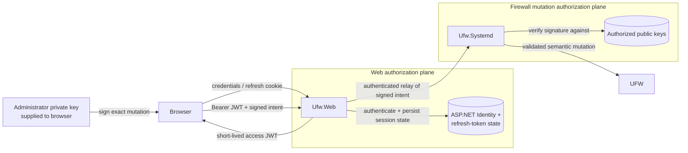

# Security Architecture

This document narrows the [system architecture](architecture-overview.md) to its trust and authorization boundaries. UFWeb assumes that the network-facing web tier is a larger and less trusted attack surface than the privileged firewall daemon, so ordinary web authentication is deliberately separate from authorization to execute a firewall mutation.

The objective is not to make `Ufw.Web` harmless if compromised. It is to prevent compromise of the ASP process alone from becoming sufficient authority to forge a new valid firewall mutation or silently replace the browser signing client.

## Trust boundaries

The browser trusts the frontend artifact it receives to display the mutation being approved and to construct the signed request faithfully. `Ufw.Web` authenticates users and controls access to the REST API, but it is not trusted to authorize privileged firewall changes by itself. `Ufw.Systemd` independently verifies mutation signatures against operator-managed public keys and is the only UFWeb component allowed to execute UFW. Beneath the daemon, UFW and the host operating system remain authoritative for firewall and interface state. PostgreSQL is trusted for application and authentication persistence only; it is never treated as firewall truth.

Production deployment reinforces those boundaries. nginx serves the independently built, read-only frontend image and proxies only `/api/*` to `Ufw.Web` over a private Unix socket. ASP therefore has neither a public listener nor the frontend filesystem it would need to rewrite the browser signing application. Compromising `Ufw.Web` can still expose or corrupt application-owned data and authenticated workflows, but it does not by itself give the process a valid administrator mutation key or the ability to replace the code that asks the administrator to use one.

Frontend delivery is also strict about executable browser content. nginx applies a restrictive Content Security Policy whose inline-script allowance is derived from the exact generated import map in the built client artifact. Missing framework or application assets fail as static-file errors instead of falling through to the SPA shell. That behavior is operationally useful because frontend-integrity mistakes remain visible rather than being “fixed” by weakening the script policy.

## Two authorization planes

Web authentication and firewall mutation authorization answer different questions. A JWT access token establishes that the HTTP caller may use an API endpoint. It is issued by `Ufw.Web` after ASP.NET Core Identity authentication and is validated by the REST layer.

A signed intent answers a narrower and more privileged question: did an administrator holding an authorized key approve this exact firewall mutation for this daemon deployment? The browser creates that intent and `Ufw.Systemd` verifies it. `Ufw.Web` can forward the envelope, but it cannot substitute an ASP-generated authorization decision for the administrator's signature.

A normal browser mutation therefore has to cross both planes. Losing either one is sufficient to reject the operation: a valid web session cannot manufacture firewall authority, and possession of a mutation key does not by itself grant unauthenticated access to the REST workflow.

The two checks deliberately happen in different processes and use different state. The JWT gates access to the web workflow, while the daemon accepts a privileged mutation only after independently validating the browser-produced intent against operator-managed key material.

## Signed mutation authorization

Append add, ordered insertion, delete, and reorder use the versioned contract defined in [Signed mutation intent v2](../protocols/signed-intent.md). Every intent binds the protocol domain, daemon deployment identity, authorized-key identifier, issuance time, random nonce, and operation name. The operation payload then binds exactly the state that makes that operation meaningful. Append add covers the complete normalized rule. Ordered insertion covers the new rule together with the exact reviewed-snapshot fingerprint, one snapshot-local anchor occurrence, and before/after placement. Delete covers the normalized rule plus semantic rule identity. Reorder covers the exact reviewed-snapshot fingerprint and the complete desired occurrence permutation.

JSON formatting is not itself authorization input. The daemon validates the payload, reconstructs the canonical byte representation, and verifies an ECDSA P-256/SHA-256 signature against its local authorized-key store. Canonicalization makes the signature describe semantics rather than one particular JSON serialization.

Several attacks are excluded by what the signed envelope binds. The deployment identifier prevents a request approved for one daemon installation from being replayed against another. The operation field prevents a valid signature for one mutation kind from being reused as another. The operation-specific payload prevents ASP or any other intermediary from changing the rule, target, anchor, or requested order without invalidating the signature.

## Replay and freshness

A valid signature is intentionally single-use. Every intent carries both an issuance timestamp and a random nonce. The daemon checks allowed clock skew and maximum intent age before it enters the privileged mutation boundary. After verification succeeds, it serializes the mutation under the UFW execution gate and durably consumes the nonce before starting a mutating subprocess.

Replay state survives daemon restart and is retained through the same time window in which the signed request could otherwise remain valid. Corrupt, unreadable, or unwritable replay state fails closed, so restarting the service or racing two copies of the same request cannot turn one approval into multiple mutations.

Authorized public keys, the deployment identity, and replay state are daemon/operator-owned files. The REST API intentionally exposes no endpoint for enrolling mutation keys or rewriting replay state. Key lifecycle is therefore an operator concern rather than a capability delegated to the network-facing application.

## Semantic target integrity

UFW row numbers are transient presentation state. Inserting or removing a rule can renumber everything below it, so a number observed in the browser cannot safely become durable authorization for a later delete. UFWeb instead signs semantic rule identity and resolves that identity against fresh authoritative state inside the daemon's serialized execution boundary. Delete proceeds only when the signed identity matches the signed rule and resolves to exactly one current row; the daemon uses that row's current UFW number only as the final CLI coordinate.

State-conditioned ordering operations need a different kind of identity because duplicate semantic rules must remain distinguishable. The browser fingerprints the complete ordered firewall-list projection that the administrator reviewed and numbers occurrences within that snapshot. The fingerprint binds the meaning of those occurrence numbers. Ordered insertion signs one anchor occurrence and its relative placement, while reorder signs the complete desired occurrence permutation. The daemon first requires its fresh snapshot to match the signed fingerprint and only then interprets the occurrence coordinates.

A rule that UFWeb cannot parse and semantically validate completely remains observable but does not acquire mutation authority by accident. Such a row has no semantic delete target. During reorder it may remain as an immutable anchor in the signed snapshot, but the daemon will not delete and recreate it unless it can render the row losslessly. This keeps partial parser understanding on the read side from silently expanding the privileged write surface.

The full identity, duplicate, and reconciliation model is documented in [Firewall state and rule model](firewall-model.md).

## Privileged process boundary

Signed authorization grants permission for a semantic operation, not for arbitrary shell or UFW command text. The daemon validates the corresponding rule/snapshot semantics and derives the concrete UFW invocation itself. Every command is rendered as validated argv and executed directly; user-controlled rule text is never interpolated into a shell command.

Host-dependent preconditions are checked at the same boundary. Append add and ordered insertion verify that referenced interface names exist in a fresh daemon-observed interface snapshot. That check does not trust ASP's cached interface metadata. Delete deliberately omits interface-existence validation so a rule remains removable after its interface has disappeared. Ordered insertion also requires an exact baseline match and requires the inserted rule's concrete family to agree with the parsed anchor family.

Starting a UFW process transfers responsibility to the daemon until that process has exited or has been terminated and reaped. The daemon then verifies authoritative UFW state instead of treating the process exit code as the mutation result. Ordered insertion is one state-conditioned insert and can be checked directly against its exact post-state. Reordering is more complicated because one logical move uses a delete/reinsert pair, so the daemon derives the move plan itself and persists a recovery record before a row can be removed. If the operation is interrupted, later startup or mutation processing must either confirm the row is present, restore it, or fail closed with the recovery obligation intact.

Cancellation, an ambiguous post-mutation listing, or a successful exit code without the expected state transition therefore cannot be promoted into a confirmed result. The recovery mechanism also does not claim packet-level atomicity: traffic can observe the short intermediate policy state between sequential UFW commands during a move.

## IPC transport security

The local IPC endpoint is protected first by operating-system permissions. Production exposes a group-restricted Unix-domain socket only to the ASP container. This local peer-admission boundary is separate from mutation authorization: access to the socket permits a process to speak the daemon protocol, not to manufacture a valid signed mutation.

TLS is optional on top of that local transport. When enabled, the IPC client authenticates the daemon certificate, and the daemon can additionally require a client certificate for mTLS. Disabling TLS leaves confidentiality and peer authentication to the local socket boundary, but it does not change the signed-intent requirement for privileged mutations.

The IPC wire protocols are versioned and bounded so malformed framing and malformed application envelopes fail before endpoint execution. The detailed transport and application contracts are documented under [IPC protocols](../protocols/README.md).

## Web authentication and session state

`Ufw.Web` uses ASP.NET Core Identity with short-lived ES256 access tokens. Refresh tokens are random opaque values carried in a `Secure`, `HttpOnly`, `SameSite=Strict` host-prefixed cookie, while PostgreSQL stores only their hashes.

The access token is carried explicitly in the `Authorization` header and is therefore not ambient browser authority. The refresh and logout endpoints are different: they intentionally act on the refresh cookie. `Ufw.Web` therefore uses ASP.NET Core antiforgery protection for those operations. A safe antiforgery endpoint issues the framework cookie and returns its paired request token; the browser sends that request token in `X-UFWeb-CSRF`, and refresh/logout validate the pair through a narrow endpoint middleware backed by ASP.NET Core's antiforgery service. The antiforgery cookie is host-prefixed, `Secure`, `HttpOnly`, `SameSite=Strict`, and path `/`. This gives the cookie-authenticated operations an explicit per-browser antiforgery credential rather than relying on `SameSite` or CORS alone.

A successful refresh rotates the token. Reuse of a revoked token invalidates the remaining active members of its token family, and each family captures the user's Identity security stamp so account-security changes can prevent indefinite refresh from stale credentials. Lockout and account-confirmation policy is checked before new access tokens are issued.

An authenticated user can change their password from the account settings UI. The server verifies the current password through ASP.NET Core Identity, updates the password/security stamp, explicitly revokes the user's existing refresh tokens, and issues a replacement access/refresh pair for the browser that performed the change. Other browser sessions therefore lose refresh capability immediately, while any access JWT they already hold remains subject to the normal short access-token expiry window.

Because same-origin tabs share the refresh cookie, the browser serializes login, refresh, password changes, and logout through an exclusive cross-tab lock. This prevents two tabs from independently rotating the same cookie and invalidating one another's view of the session. The production topology consequently exposes one consistent HTTPS browser origin for the tabs participating in that coordination.

Refresh-family revocation does not retroactively invalidate an already-issued access JWT. An access token remains valid until its short expiration, so deployment policy must choose that lifetime according to the acceptable revocation window.

## Browser signing keys

The UI accepts an unencrypted PKCS#8 P-256 private key when a mutation is signed. The application clears the input after the operation and does not write the key to browser storage, PostgreSQL, ASP configuration, or daemon state. Only the corresponding public key belongs in the daemon's `authorized_keys` file.

This is intentionally a small key-handling model. Persistent browser enrollment, WebAuthn or hardware-backed credentials, key revocation workflows, and user-to-key administration would introduce new trust and lifecycle questions and therefore require an explicit design rather than silently extending the current storage behavior.

## Security limits

The architecture does not make a compromised administrator browser, browser extension, or delivered frontend artifact safe; those components participate directly in presenting and signing the operation. It also does not provide dynamic mutation-key enrollment, immediate revocation of already-issued access JWTs, or a complete security audit/accountability subsystem. Those are separate capabilities rather than implied properties of the current authentication and signed-intent design.

At the host boundary, `Ufw.Systemd` serializes only its own UFW access. An administrator or unrelated process can still invoke UFW concurrently, so UFWeb detects and reports state divergence rather than claiming a cross-process lock it does not own. Privileged mutation authority exists only for operations with an explicitly defined signed-intent contract, and compound reorder remains a sequence of UFW CLI mutations rather than a packet-atomic replacement of the entire ruleset.

Out-of-band UFW administration is therefore supported as a normal state-model input, while a truly simultaneous external mutation remains an unavoidable race at the host tool boundary. When the daemon can no longer establish a unique authoritative result, it fails conservatively and requires a fresh observation rather than guessing which state should be treated as committed.
