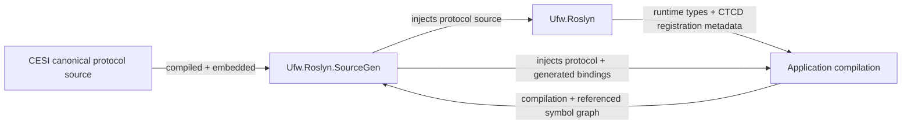

# Compile-Time Routing and Serialization

UFW WebUI uses source generation to keep daemon routing and protocol serialization compatible with NativeAOT without making the analyzer depend on concrete runtime implementation types. The runtime-facing abstractions live in `Ufw.Roslyn`; the analyzer-only implementation lives in `Ufw.Roslyn.SourceGen`.

The boundary follows two related patterns:

- **Canonical Embedded Source Introspection (CESI)** supplies the small registration protocol that must exist on both sides of the analyzer boundary from one canonical source definition.
- **Compile-Time Contract Discovery (CTCD)** lets runtime/framework code bind stable semantic generator roles to the concrete Roslyn symbols that fulfill those roles in the active compilation.

The result is compile-time dependency inversion: generator logic reasons about semantic roles and resolved symbols instead of hard-coded runtime metadata names.

## Component boundary

`Ufw.Roslyn.SourceGen` is packaged as an analyzer. It owns generator algorithms, the canonical contract vocabularies, contract discovery, diagnostics, and source emission. It does not take a normal runtime reference on `Ufw.Roslyn` and does not load consumer assemblies into the analyzer process.

`Ufw.Roslyn` owns the runtime-facing routing and serialization abstractions used by application projects. It also declares the CTCD registrations that associate those concrete types with the semantic roles understood by the corresponding generator family.

Application projects that require generated routing or JSON bindings reference `Ufw.Roslyn` normally and attach `Ufw.Roslyn.SourceGen` as an analyzer. `Ufw.Roslyn` itself also attaches the analyzer so the CESI registration protocol is available when its provider registrations compile. During application compilation, the analyzer observes the active compilation and its references through Roslyn symbols, resolves the registered contracts, and emits code against those symbols.

## Canonical registration protocol

The registration protocol is authored as ordinary C# source inside the analyzer project and is both compiled into the analyzer assembly and embedded as source text. During Roslyn post-initialization, the analyzer injects the exact embedded source into analyzer-consuming compilations.

The protocol consists of a generic contract-registration attribute plus cohesive contract vocabularies. The controller-routing generator and JSON generator deliberately use separate vocabularies:

- the **controller contract family** describes controller mapping triggers, controller registrations, routing attributes, endpoint mapping infrastructure, activation, and identifiable-response semantics;
- the **JSON contract family** describes JSON binding triggers, the AOT serializer-context abstraction, `JsonSerializable` metadata, and `JsonTypeInfo` metadata.

Separating the families is an architectural boundary rather than only an organizational choice. A generator resolves and validates only its own family, so JSON contract evolution cannot introduce controller requirements and controller contract evolution cannot introduce JSON requirements. An independent generator concern should normally define its own cohesive contract family instead of extending an unrelated vocabulary.

The enum values in each family are explicit protocol identifiers. They must remain stable for the lifetime of that contract family because independently compiled assemblies can carry registrations created from separately injected copies of the same protocol source.

## Contract discovery

`Ufw.Roslyn` publishes assembly-level registrations that map each semantic contract role to the concrete type that fulfills it. These registrations can refer to types owned by `Ufw.Roslyn` or to framework types such as System.Text.Json abstractions.

For each generator family, discovery scans the current compilation assembly and referenced assemblies through Roslyn's symbol graph. Registrations are recognized by the metadata identity of the canonical CESI protocol, then converted into a typed immutable binding used by the generator pipeline.

Contract resolution is fail-closed once a family is present:

- every required role in that family must be registered exactly once;
- malformed or unknown registrations are build errors;
- duplicate providers are build errors rather than reference-order-dependent selection;
- missing required providers are build errors;
- dependent generation stops when the family cannot be resolved safely.

If no registrations for a contract family exist at all, that generator family is inactive for the compilation. This allows the analyzer package to be present without forcing unrelated projects to provide routing or JSON contracts they do not use.

## Symbol-based generation

After discovery, generator stages receive typed contract bindings containing `INamedTypeSymbol` instances. Matching, inheritance checks, and emitted type references use those symbols instead of reproducing implementation namespaces or type names as strings.

This distinction matters for maintainability and AOT compatibility. Runtime types can move between namespaces or assemblies as long as their provider registrations move with them, while generated code still contains ordinary static type references that trimming and NativeAOT can analyze.

Cross-assembly protocol recognition uses metadata identity only for the small CESI registration protocol itself. Equivalent injected protocol declarations in different assemblies are intentionally not assumed to share Roslyn symbol identity. Concrete provider types, once resolved, are handled as normal Roslyn symbols.

## Packaging and failure invariants

The analyzer packaging is part of source-generation correctness. Each CESI protocol source unit must be compiled into `Ufw.Roslyn.SourceGen` and embedded under the resource identity derived from its canonical type. Missing embedded source is an analyzer packaging defect and fails deterministically rather than falling back to a reconstructed declaration.

The source-generation layer therefore depends on these invariants:

1. one canonical source definition exists for each injected protocol declaration;
2. controller and JSON contracts remain separate cohesive families;
3. provider assemblies declare concrete role bindings instead of generators hard-coding implementation metadata names;
4. discovery uses Roslyn symbols only and never loads provider assemblies for reflection;
5. required roles resolve uniquely before dependent source is emitted;
6. generated code references resolved symbols rather than copied implementation-name strings.

When adding a generator dependency on another runtime-owned type, first decide which semantic family owns that dependency. Add a stable role to that family, register the provider beside the runtime implementation, expose it through the family's typed binding, and consume the resolved symbol in generation. This keeps implementation ownership on the runtime side while preserving an analyzer/runtime dependency direction suitable for NativeAOT.
