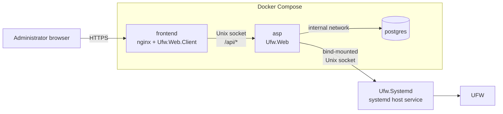

# Production Deployment

This section is for operators deploying UFWeb on the firewall host. The production topology is the same for rootful and rootless Docker; the runbooks differ only where host/container ownership and group mapping differ.

UFWeb is not deployed as one privileged container. The host daemon owns UFW access, while the public web surface stays in non-root application containers:

The `frontend` container is the only service with a published host port. It serves the immutable WebAssembly client and browser-facing TLS, then proxies `/api/*` to `Ufw.Web` through an application Unix socket. `Ufw.Web` is a private non-root container; PostgreSQL is reachable only on the internal database network. `Ufw.Systemd` runs directly under systemd and exposes a group-restricted host Unix socket to ASP.

This separation is part of the security model, not merely container layout. Do not give the application containers firewall capabilities, UFW files, daemon authorization state, or the host Docker socket, and do not merge the frontend filesystem into an ASP-writable runtime image. See [Security architecture](../architecture/security.md) for the trust model.

## Choose the Docker ownership model

Use exactly one of the supported runbooks:

| Docker mode | Runbook | Host-file/group model |
| --- | --- | --- |
| Rootful Docker daemon | [Rootful Docker deployment](rootful-docker.md) | explicit host group GIDs are added to the affected frontend/ASP containers |
| Rootless Docker daemon | [Rootless Docker deployment](rootless-docker.md) | supplemental container GID `0` maps to the rootless Docker user's primary host group |

Do not combine ownership/group steps from the two guides. The application topology and configuration keys are the same, but the host permission mapping is not.

## Host paths and persistent state

The deployment deliberately separates the daemon's public-to-ASP IPC surface from root-only daemon security state:

| Host path/state | Purpose |
| --- | --- |
| `/var/lib/ufw-webui/ipc/ufw-systemd.sock` | group-restricted daemon socket bind-mounted read-only into ASP at `/run/ufw-manager` |
| `/etc/ufw-manager/settings.json` | daemon configuration |
| `/etc/ufw-manager/authorized_keys` | operator-managed administrator mutation public keys |
| `/var/lib/ufw-manager/` | daemon deployment identity, replay records, and reorder recovery state |
| PostgreSQL storage | ASP-owned users, refresh-token state, authoring metadata, and rule presentation metadata |
| frontend TLS directory | browser-facing certificate/key mounted into nginx |
| ASP JWT key | private ES256 signing key mounted into `Ufw.Web` |

The IPC directory is intentionally outside `/run`; this works in both Docker modes and avoids RootlessKit's private/copied-up `/run` behavior. The root-only `/var/lib/ufw-manager` directory must never be mounted into the application stack.

Administrator mutation **private** keys are not deployment secrets for ASP or the daemon. Only their public keys belong in the daemon `authorized_keys` file; the private key stays with the administrator/browser signing workflow.

## Deployment sequence

The mode-specific runbooks follow the same conceptual order:

1. build and install `Ufw.Systemd` on the host;
2. provision an administrator mutation keypair and install only the public key in daemon authorization state;
3. provision the ASP JWT signing key and browser-facing TLS material;
4. configure `deploy/docker/.env`, PostgreSQL storage, and the host group mappings for the chosen Docker mode;
5. build/start the `frontend`, `asp`, and `postgres` services;
6. verify the browser/API/daemon/firewall boundaries independently.

The host does not need a .NET SDK or NativeAOT toolchain. `deploy/systemd/publish.sh` performs the daemon NativeAOT build in Docker and exports the native Linux executable used by the installer.

## Configuration and secrets

[Deployment configuration](configuration.md) is the shared reference for:

- Compose environment variables and image/bind settings;
- ASP authentication/JWT/bootstrap configuration;
- daemon UFW, IPC, timeout, and signed-intent security settings;
- which process owns each private key or security-state file.

The runbooks contain the concrete creation/permission commands because those differ between rootful and rootless hosts. Keep configuration reference and installation order separate: use the runbook to deploy and the configuration document to understand or customize a setting.

## Verification and operations

A healthy installation should establish each boundary separately rather than treating a loaded web page as proof that the firewall path works. The runbooks finish by verifying:

- the public HTTPS frontend and static application assets;
- `Ufw.Web` management health through nginx;
- daemon liveness across the local IPC boundary;
- authoritative UFW rule/configuration reads;
- authenticated access and signed mutation authorization.

After installation, use [Deployment operations](operations.md) for routine verification, PostgreSQL backups, daemon/container updates, rollback, reorder-recovery handling, and daemon uninstall.

## Development is a different topology

The repository-root `docker-compose.yml` is development-only and starts PostgreSQL for local development. It is **not** a production stack. Production uses `deploy/docker/compose.yml` together with one of the two runbooks above.
