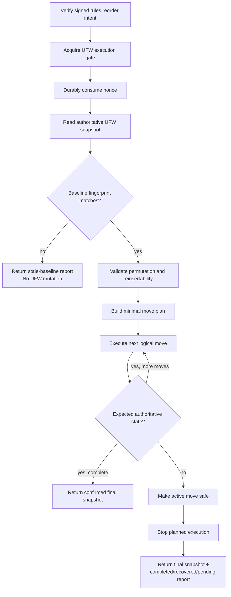
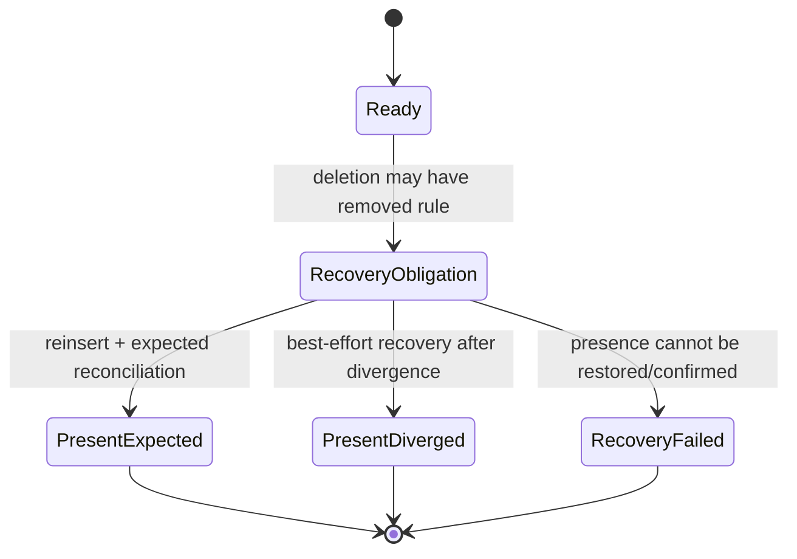

# Firewall Rule Reordering Design

> **Status:** Implemented design record. Permanent steady-state behavior is documented in [Firewall state and rule model](../architecture/firewall-model.md), [Security architecture](../architecture/security.md), and [Signed mutation intent v2](../protocols/signed-intent.md). This internal document preserves the design rationale and is not normative.

Firewall rule ordering is security-relevant state. UFW evaluates ordered rules using first-match semantics, while UFW WebUI deliberately allows UFW state to change outside the application. Reordering therefore cannot be modeled as a sequence of independent positional edits sent from the browser. The mutation must bind the user's reviewed ordering to an exact authoritative baseline, execute as one serialized daemon operation, and report partial progress precisely if that baseline stops being trustworthy during execution.

The target design keeps the existing browser preview interaction, but changes the authority boundary behind **Apply reordering**. Browser-local drag/drop history remains presentation state. The privileged request expresses the complete desired order relative to the exact snapshot the user reviewed.

## Design goals

The reordering flow must preserve the existing trust model and satisfy these invariants:

- UFW remains the firewall source of truth. PostgreSQL does not acquire an authoritative rule-order model.
- `Ufw.Web` remains unable to manufacture privileged mutation authority. The browser signs the complete state-dependent reorder intent and the daemon verifies it independently.
- A reorder intent applies only to the exact ordered firewall snapshot the browser reviewed. A stale baseline is rejected without starting a UFW mutation.
- Every row in the baseline has an unambiguous snapshot-local occurrence identity, including semantic duplicates and opaque rows.
- The daemon minimizes the number of rules that must be physically removed and reinserted while respecting rows that cannot safely be reconstructed.
- Once a logical move has removed a rule, restoring that rule becomes an unconditional recovery obligation. Cancellation, state divergence, or a failed reorder plan must not intentionally leave the row absent.
- Unexpected state changes stop further planned mutations after the active move has been made safe. The daemon reports completed, recovered, and pending work together with the final authoritative state.
- Success is reported only after the daemon confirms that the complete authoritative order equals the signed desired order.

The UFW CLI does not provide a packet-level transaction around a delete/insert pair. "Atomic move" in this design therefore means daemon control-flow and recovery atomicity: the daemon does not voluntarily abandon a rule between deletion and confirmed reinsertion. Packets may still observe an intermediate UFW policy while the CLI operations are in progress.

## Request model

A signed reorder request represents a state transition, not a list of UI gestures.

Conceptually, the signed payload contains:

```text
baselineFingerprint = SHA-256(canonical authoritative snapshot)
desiredOrder        = permutation of baseline occurrence IDs
```

The browser assigns each row an occurrence ID equal to its zero-based position in the authoritative baseline it received. These IDs are local to that snapshot. They are not UFW display numbers, semantic `ruleId` values, or durable identifiers.

For a baseline

```text
occurrence: 0 1 2 3 4
rule:       A B C D E
```

a preview such as `A D B E C` signs the desired occurrence permutation:

```text
0 3 1 4 2
```

This representation distinguishes duplicate rows naturally because two identical rules still occupy distinct baseline occurrences. It also includes opaque rows in the ordering model even when those rows cannot themselves be recreated.

The desired order must contain exactly the baseline occurrence set: for a baseline of `n` rows, every occurrence ID from `0` through `n - 1` appears exactly once. The request cannot add, omit, or substitute a row.

The signed intent does not contain the browser's sequence of drag/drop moves. Different gesture histories that produce the same final ordering authorize the same firewall state transition.

### Snapshot fingerprint

Occurrence IDs are meaningful only in conjunction with the exact baseline from which they were assigned. The signed payload therefore carries a cryptographic fingerprint of the complete authoritative snapshot.

The fingerprint uses a domain-separated canonical representation shared by the browser and daemon and SHA-256 as the collision-resistant digest. The canonical snapshot commits to:

- firewall active state where observable through the listing contract;
- row count and row order;
- every row's complete observed representation, including information required to distinguish parsed, duplicate, and opaque rows;
- all security-relevant structured fields exposed for parsed rows.

The canonical form must not rely on `ruleId`: semantic rule identity intentionally excludes information such as comments and is not unique for duplicate rows. The snapshot representation must be strong enough that two states which are unsafe to treat as the same reorder baseline cannot share a canonical input except through a cryptographic collision.

The browser computes the fingerprint from the snapshot it actually displays and signs that value. It must not trust an opaque fingerprint supplied by `Ufw.Web`. This preserves the existing threat model: a compromised web application cannot pair a genuine daemon-generated token with a different rule list shown to the signer.

The daemon independently computes the same fingerprint from a fresh UFW read under its execution gate. Planning uses occurrence IDs directly after this equality check; it does not repeatedly hash semantic planner states.

### Signed-intent integration

Reordering is a distinct signed operation, `rules.reorder`. It reuses the existing signed-intent envelope and daemon-managed authorized keys, freshness policy, deployment identity, and nonce replay protection. Its operation-specific canonical payload binds the baseline fingerprint and complete desired occurrence permutation.

Signed-intent v2 permits operations with independently defined payload semantics, so reordering uses the existing envelope version with its own canonical snapshot and payload contract. The frozen wire representation is documented in the permanent signed-intent protocol.

`Ufw.Web` authenticates the REST request and forwards the signed operation through the typed IPC boundary. It does not calculate the privileged move plan and does not reinterpret occurrence IDs.

## Browser preview lifecycle

The current preview interaction remains conceptually valid. A successful authoritative rule read starts with no preview. Dragging a rule or selecting a target position creates a browser-local projection over that snapshot. Add/delete mutations remain disabled while a reorder preview exists.

The preview model changes from semantic `ruleId` addressing to baseline occurrence addressing. This removes the current ambiguity for duplicate semantic identities and allows all displayed rows to participate in one exact permutation even when some rows are read-only anchors.

Applying a preview performs these high-level steps:

1. require a current authoritative snapshot;
2. obtain the normal daemon intent context;
3. canonicalize and fingerprint the snapshot in the browser;
4. sign the complete desired permutation and baseline fingerprint;
5. submit one reorder request;
6. replace the browser's authoritative state with the final snapshot returned by the daemon;
7. present the reorder execution report when the operation was partial or required recovery.

A normal refresh invalidates the preview because it establishes a new baseline and therefore a new occurrence-ID namespace.

A residual plan returned after partial execution is diagnostic and presentational state, not reusable authorization. Continuing from the returned state requires a fresh preview confirmation and a new signed intent.

## Daemon execution lifecycle

The daemon verifies the signed intent before entering the privileged mutation boundary, as it does for add and delete. Reorder execution then retains the existing global UFW execution gate for the complete operation.



The nonce is consumed before a privileged subprocess can start. A request rejected as stale after nonce consumption is not reusable if the firewall later happens to return to the old state; the user must review the current snapshot and sign a new operation.

Before the first delete, the daemon validates the entire desired permutation and confirms that every row which the plan may need to move has a lossless reconstruction suitable for UFW reinsertion. Rendering and other deterministic preflight work completes before the mutation starts.

### Reinsertability and immutable anchors

A row being structurally parsed is not by itself sufficient evidence that it is safe to reorder. A movable row must have a representation from which the daemon can recreate the complete observed firewall semantics without silently dropping information.

Rows that cannot meet that requirement remain part of the signed permutation but act as immutable anchors: they may shift position because other rules move around them, but the planner must never choose them for delete/reinsert. Their relative order therefore cannot change.

This makes reliable UFW round-trip representation a prerequisite for enabling reorder on affected rule shapes. The implementation keeps rows immutable whenever their observed semantics cannot be reconstructed losslessly; reordering does not weaken semantic comparison merely to make such rows movable.

Address-family-neutral authoring is not reconstructed during reordering. The reorder baseline consists of the concrete rows UFW actually exposes, including concrete IPv4 and IPv6 materializations. The signed permutation therefore targets the concrete authoritative list.

## Minimal move planning

Once the baseline fingerprint matches, reorder planning is an integer-permutation problem. Semantic hashes are not planner identities and are not required for normal plan calculation.

For two permutations of the same baseline occurrences, the rules that can remain physically untouched form a longest common subsequence. Mapping the current occurrence sequence to each occurrence's position in the desired order reduces this to a longest increasing subsequence (LIS) problem.

The planner therefore:

1. maps the current occurrence sequence into desired-position indices;
2. finds an LIS, representing occurrences that can remain untouched;
3. moves every remaining movable occurrence exactly once into the required relative position.

This yields the globally minimal number of remove/reinsert moves for the normal unit-cost move model. The standard LIS solution runs in `O(n log n)` time and avoids state-space graph search.

Non-reinsertable rows are mandatory members of the untouched subsequence. Their relative order is validated first; planning can then treat them as fixed anchors and solve the movable segments between them. A requested order that would require moving an immutable anchor is rejected before the first UFW mutation.

Where several equally minimal plans exist, deterministic tie-breaking should prefer leaving higher-risk movable rules untouched. This is a secondary safety choice among plans with the same minimal move count; non-reinsertable rows remain mandatory anchors rather than weighted preferences.

## Logical move atomicity and recovery

A planned move is a daemon-level mini-transaction consisting of removing one concrete occurrence and reinserting that same rule at an ordered position. The UFW execution gate remains held throughout.

Before deletion, the daemon records enough durable recovery information to reconstruct the rule and identify its safe pre-move neighborhood. The recovery record is cleared only after an authoritative read confirms that the rule is present again.

The logical lifecycle is:



After a delete attempt, the daemon reconciles authoritative state. If the expected post-delete state is present, it performs the planned positional insertion. If state has diverged, the reorder plan is no longer trusted, but the removed rule is still reinserted as a best-effort recovery action before the request can stop.

Recovery favors the rule's pre-move neighborhood rather than forcing the stale desired target. Where the original neighboring occurrences remain identifiable, they provide the safest placement anchors. If exact placement cannot be reconstructed, restoring the row takes precedence over preserving ordering, and the resulting uncertainty is reported explicitly.

A failed delete is also reconciled. If the rule is still present, no recovery insertion is required. If the rule is absent despite the subprocess failure, the same recovery obligation applies.

Once deletion may have taken effect, caller cancellation no longer interrupts cleanup. The daemon owns the active move until the row's presence has been confirmed or recovery has failed conclusively. Cancellation may stop the transaction before the next logical move begins.

### Crash recovery

Exception handling alone cannot uphold the row-preservation invariant if the daemon exits between delete and insert. The steady-state design therefore includes a durable single-move recovery journal.

The journal is persisted before a move can remove its rule and contains the information required to recognize or reconstruct the outstanding occurrence. On daemon startup, an incomplete journal is reconciled before new firewall mutations are accepted. If the row is already present, the journal can be completed. If it is absent and recovery is unambiguous, the daemon restores it. If safe recovery cannot be established, mutation processing fails closed and surfaces an operator-visible recovery condition rather than guessing.

The journal protects move-level recovery only. It is not a second authoritative firewall database and does not preserve a long-lived desired ordering.

## Divergence and out-of-band changes

Out-of-band UFW changes are handled differently depending on when they occur.

A change before execution produces a baseline fingerprint mismatch. No rule is moved, and the browser receives the current authoritative state for review.

A change during execution cannot be prevented by the daemon's in-process UFW gate because another process may invoke UFW directly. The design assumes such changes are rare during the short sequential mutation window, but it does not assume they are impossible. Reconciliation after each logical step detects divergence.

Any unexpected divergence stops the planned transaction after the active rule has been made safe. The daemon does not silently continue applying a plan derived from state that is no longer authoritative. Follow-up ordering is a separate reviewed and signed operation.

If the final observed state still contains an unambiguous mapping of the original baseline occurrences, the daemon may recompute the minimal residual plan from that state to the signed desired ordering for diagnostics. If rows were added, removed, changed, or duplicates make remapping ambiguous, the daemon reports which intended operations are blocked rather than inventing executable residual moves.

## Result and diagnostics model

A reorder response is a transaction report, not only a success/failure flag. Every outcome after the operation enters the serialized execution boundary carries the final authoritative snapshot whenever it can be read safely.

The report distinguishes at least:

- operations applied and confirmed;
- operations that encountered a failure or divergence but whose removed rule was restored;
- operations not started because execution stopped;
- residual operations that can still be derived safely from the final state;
- divergence or recovery diagnostics;
- whether the complete signed desired order was reached.

Expected high-level outcomes include complete success, stale baseline before mutation, partial completion with safe recovery, partial completion caused by state divergence, and recovery/state uncertainty.

The daemon IPC boundary carries every successfully verified/executed reorder transaction as a typed data response so the complete report survives transport even when the requested ordering was not reached. Signature, authorization, replay, and malformed-envelope failures remain normal IPC error responses.

The REST layer maps transaction outcomes while preserving the report body: complete execution returns `200`, stale or partially completed execution returns `409`, a precondition failure returns `422`, recovery failure returns `500`, and state uncertainty returns `503`. This mapping distinguishes transaction outcomes from transport/security errors without discarding diagnostics. The browser uses the returned authoritative snapshot as its new source of truth and presents completed, recovered, and pending work to the administrator.

A pending operation is informational. It does not carry forward the original nonce or authorize automatic retry.

## Failure boundaries

The daemon distinguishes three kinds of failure because they imply different safety guarantees.

**Precondition failure** occurs before the first UFW mutation, for example a stale baseline, malformed permutation, or required immutable-anchor movement. The firewall remains unchanged.

**Plan interruption with recovered row presence** occurs after one or more moves have committed, or when an active move encounters divergence but the affected rule is confirmed present afterward. Ordering may be only partially applied, but the daemon can describe the authoritative resulting state and the unapplied remainder.

**Recovery uncertainty** means the daemon cannot confirm that a rule removed by the active move is present in the final state or cannot obtain a trustworthy authoritative snapshot. The operation fails conservatively, retains/logs the recovery condition as appropriate, and must not claim that the firewall reached either the original or desired ordering.

These categories are part of the service contract because the browser must communicate materially different operator actions for each case.

## Component responsibilities

The steady-state ownership remains aligned with the existing architecture:

- **`Ufw.Client`** owns local preview projection, snapshot canonicalization for signing, private-key interaction, and presentation of reorder reports.
- **`Ufw.Web`** owns HTTP authentication and transport adaptation. It forwards the signed reorder request and structured result without becoming reorder authority.
- **`Ufw.Shared`** owns the cross-process reorder payload/result model, snapshot canonicalization, signed-intent canonicalization, and ordering concepts that must be identical on both sides of a boundary.
- **`Ufw.Systemd`** owns independent signature verification, nonce consumption, authoritative baseline verification, move planning, serialized UFW execution, recovery journaling, reconciliation, and final result classification.
- **UFW** remains authoritative for the actual ordered firewall state throughout the operation.

The planner should remain separate from UFW subprocess execution. It consumes occurrence permutations plus moveability constraints and produces a deterministic logical plan. This keeps algorithmic correctness independently testable from process/recovery behavior.

## Scope boundaries and follow-up design

This design covers reordering existing concrete UFW rows. It does not define ordered rule creation. Insert-before/insert-after authoring should reuse the same snapshot-precondition concepts where useful, but it requires a separate signed operation because creation changes the rule set rather than permuting an existing one.

The design also does not attempt to provide kernel- or packet-level atomic replacement of the complete UFW ruleset. Achieving that guarantee would require a different mutation mechanism below the current sequential UFW CLI boundary.

The implemented contract retains the central model established here: an exact signed baseline and desired permutation, minimal occurrence-based planning, serialized execution, mandatory row recovery, and authoritative partial-result reporting. Protocol details, recovery-state paths, REST behavior, and supported steady-state guarantees belong to the permanent documentation linked above.
